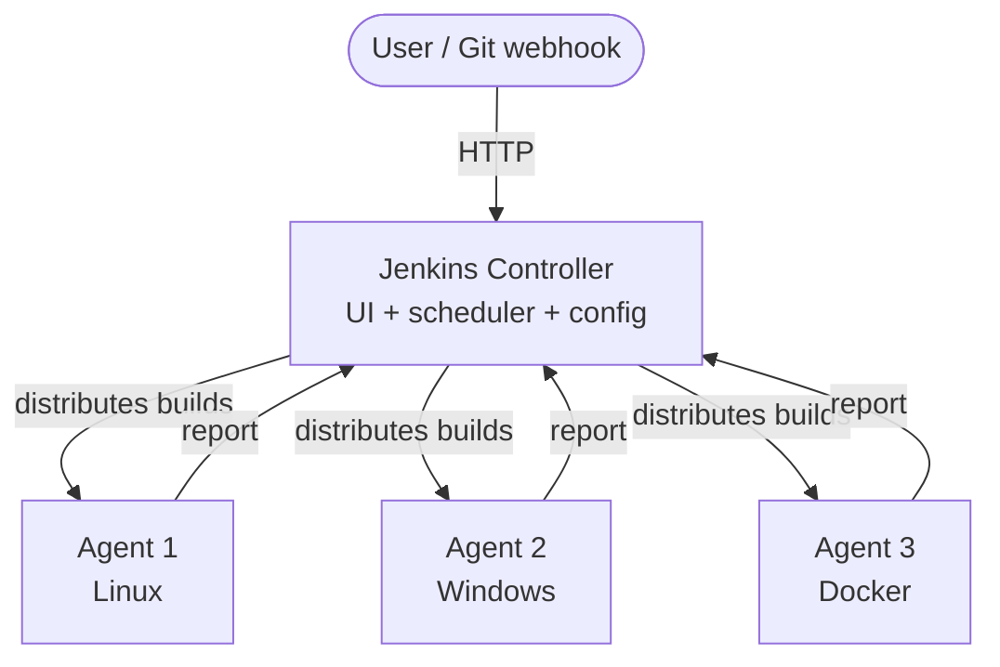
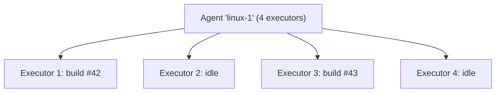
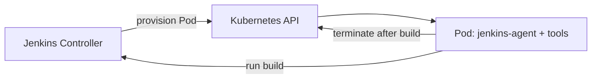

# Jenkins Architecture

> [!summary] TL;DR
> Jenkins uses a **Controller + Agents** model. The controller holds configuration, schedules jobs, and serves the UI; agents execute the actual build work.

## High-Level Architecture

## Controller (formerly "Master")

| Responsibility                | Notes                                                  |
| ----------------------------- | ------------------------------------------------------ |
| Web UI                        | Dashboard, job config, build history.                  |
| REST API                      | Drives everything from external systems.               |
| Job scheduling                | Picks an agent for each build.                         |
| Plugin management             | Install / update plugins.                              |
| Credential store              | Holds secrets (see [[Managing Credentials]]).          |
| Configuration                 | Global settings, tools, security.                      |
| Load build results & logs     | Stored under `JENKINS_HOME`.                           |

> [!warning] Don't run builds on the controller
> Running heavy builds on the controller can starve the UI and risk security. Use agents.

## Agents (formerly "Slaves")

Agents are executors that actually run jobs. Communication options:

| Method                | Use case                                                        |
| --------------------- | --------------------------------------------------------------- |
| **SSH Build Agent**   | Linux agent reachable over SSH. Most common.                    |
| **JNLP (inbound)**    | Agent initiates connection to controller (port 50000). Useful when agent is behind firewall. |
| **WebSocket**         | Modern alternative to JNLP4 (recommended for new agents).       |

## Executors

An **executor** is a slot on an agent that runs one build at a time. An agent with 4 executors can run 4 concurrent builds.

## `JENKINS_HOME`

The data directory (`/var/jenkins_home` in Docker). Contains:

- `config.xml` — global config.
- `jobs/` — per-job config & history.
- `users/` — user accounts.
- `plugins/` — installed plugins.
- `secrets/` — master key, initial admin password.
- `workspace/` — per-agent checkout directories.

> [!important] Back up JENKINS_HOME
> Treat `JENKINS_HOME` as stateful. Back it up regularly. For Docker, mount a named volume (as in [[Installation and Setup]]).

## Distributed Builds — Why & When

- **Parallelism** — more agents = more concurrent builds.
- **Platform diversity** — Linux, Windows, macOS, ARM agents.
- **Isolation** — per-team or per-project agents.
- **Security** — keep secrets out of shared executors.

## Kubernetes Plugin Pattern

Each build gets its own ephemeral Pod — no long-lived agents to maintain.

## Related Notes
- [[Installation and Setup]] · [[Dashboard Overview]] · [[Jobs]] · [[Pipelines]]
