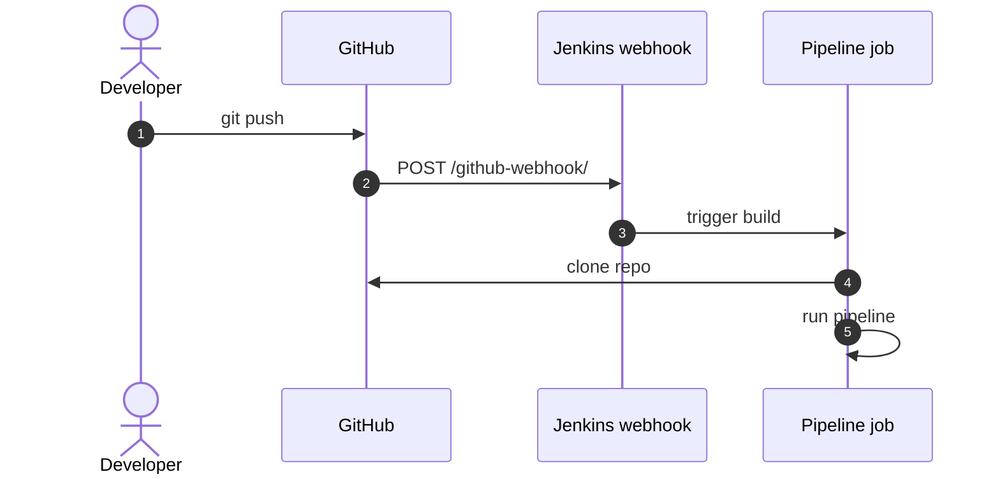

# Build Triggers

> [!summary] TL;DR
> **Build triggers** decide *when* a Jenkins job runs — manually, on a schedule, after another build, or via webhook from Git.

## Trigger Types

| Trigger                       | What it does                                                |
| ----------------------------- | ---------------------------------------------------------- |
| **Build Now** (manual)        | User clicks "Build Now".                                   |
| **Build after other projects**| Chain: run B when A finishes.                              |
| **Build periodically**        | Cron-style schedule.                                       |
| **GitHub hook trigger**       | Auto-build when GitHub pushes (with webhook).              |
| **Poll SCM**                  | Jenkins polls Git for changes. Fallback when no webhook.   |
| **Trigger builds remotely**   | Call a URL with a token to start a build.                  |
| **Pipeline triggers**         | `triggers {}` block in Declarative pipelines.              |
| **Multibranch branch discovery** | New branches/PRs auto-trigger pipelines.                |

## Cron Syntax in Jenkins

Jenkins uses a 5-field cron with `H` (hash) to spread load:

```text
┌───── minute (0-59)
│ ┌───── hour (0-23)
│ │ ┌───── day of month (1-31)
│ │ │ ┌───── month (1-12)
│ │ │ │ ┌───── day of week (0-7, 0/7 = Sunday)
H * * * *        # hourly, hash-spread minute
H/15 * * * *     # every ~15 minutes
H 2 * * 1-5      # 2 AM on weekdays
@daily           # aliases: @hourly, @daily, @weekly, @monthly
```

> [!note] Use `H` not `0`
> `H` distributes triggers across the minute/hour so all jobs don't fire at once and overload the controller.

## Declarative `triggers` Block

```groovy
pipeline {
    agent any
    triggers {
        cron('H 2 * * *')
        githubPush()
        upstream(upstreamProjects: 'core-lib', threshold: hudson.model.Result.SUCCESS)
    }
    stages { ... }
}
```

## Webhook Setup (GitHub)

1. In your GitHub repo → **Settings → Webhooks → Add webhook**.
2. Payload URL: `https://jenkins.example.com/github-webhook/`.
3. Content type: `application/json`.
4. Events: "Just the push event" (and PR if you want).
5. In Jenkins, your pipeline job must enable **GitHub hook trigger**.



## Polling (Fallback)

```groovy
triggers {
    pollSCM('H/15 * * * *')
}
```

Jenkins checks Git every ~15 min for new commits. Slower than webhooks but works behind firewalls.

## Upstream Trigger

```groovy
triggers {
    upstream(upstreamProjects: 'frontend,backend', threshold: 'SUCCESS')
}
```

Run this pipeline after `frontend` and `backend` both succeed — useful for end-to-end tests.

## Related Notes
- [[Jobs]] · [[Pipelines]] · [[Git Integration]] · [[Simple CI-CD Pipeline]]
