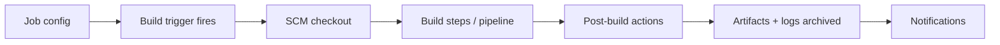

# Jobs

> [!summary] TL;DR
> A **Job** (formerly "Project") is a runnable unit of work in Jenkins — e.g. "build my app", "run tests", "deploy to staging". Modern Jenkins uses **Pipeline** jobs defined in a `Jenkinsfile`.

## Job Types

| Type                | Description                                                            | When to use                         |
| ------------------- | --------------------------------------------------------------------- | ----------------------------------- |
| **Freestyle project** | UI-configured build steps. Legacy.                                  | Simple one-off tasks.               |
| **Pipeline**        | Defined in Groovy (`Jenkinsfile`). Modern choice.                     | Any multi-step workflow.            |
| **Multibranch Pipeline** | Auto-creates a Pipeline per branch + PR.                         | Most modern teams.                  |
| **Folder**          | Group jobs / nest other items.                                        | Multi-team organizations.           |
| **Multijob / Matrix** | Run a job across multiple configurations.                           | Testing on many OS/versions.        |
| **External Job**    | Track builds run outside Jenkins.                                     | Legacy / niche.                     |

> [!tip] Modern recommendation
> Use **Multibranch Pipeline** for new work. Every branch & PR gets its own pipeline, defined in the `Jenkinsfile` committed to the repo.

## Creating a Freestyle Job (Quick Tour)

1. **New Item** → name it → choose **Freestyle project**.
2. **Source Code Management** → Git URL.
3. **Build Triggers** → e.g. "GitHub hook trigger for GITScm polling" or "Poll SCM" (`H/15 * * * *`).
4. **Build Steps** → e.g. "Invoke top-level Maven targets" → `clean package`.
5. **Post-build Actions** → e.g. archive artifacts, send email.
6. **Save** → **Build Now**.

## Creating a Pipeline Job (Modern)

1. **New Item** → name it → choose **Pipeline**.
2. Under **Pipeline** → Definition: **Pipeline script from SCM**.
3. Point to your repo + branch, script path `Jenkinsfile`.
4. **Save** → **Build Now**.

See [[Pipelines]] and [[Pipeline as Code]] for the `Jenkinsfile` content.

## Anatomy of a Job

## Build History

Each run is numbered (`#1`, `#2`, …). Click a build to see:

- Console output.
- Changes (commits since last build).
- Artifacts.
- Test results.
- Time & duration.

## Useful Operations

- **Build Now** — trigger manually.
- **Configure** — edit the job.
- **Delete** — remove the job.
- **Rename** — change name.
- **Disable/Enable** — pause without deleting.

## Related Notes
- [[Pipelines]] · [[Pipeline as Code]] · [[Stages and Steps]] · [[Build Triggers]]
