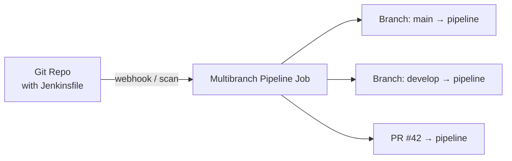

# Pipeline as Code

> [!summary] TL;DR
> **Pipeline as Code** means defining your pipeline in a `Jenkinsfile` committed to your Git repo, rather than configuring it through the UI.

## Why Pipeline as Code?

- **Versioned** — pipeline changes go through Pull Requests.
- **Auditable** — every change has a commit & author.
- **Branchable** — different branches can have different pipelines.
- **Reproducible** — new Jenkins install can run your pipeline immediately.
- **Reviewable** — code review catches bad deploys before they ship.

## Where to Put the File

By convention, commit `Jenkinsfile` at the root of your repo:

```text
my-app/
├── Jenkinsfile
├── README.md
├── src/
└── tests/
```

You can also use a subfolder (e.g. `ci/Jenkinsfile`).

## Complete Beginner Example

```groovy
pipeline {
    agent any

    environment {
        IMAGE = "myorg/app:${env.BUILD_NUMBER}"
    }

    options {
        timeout(time: 30, unit: 'MINUTES')
        timestamps()
        buildDiscarder(logRotator(numToKeepStr: '20'))
    }

    stages {
        stage('Checkout') {
            steps { checkout scm }
        }
        stage('Build') {
            steps {
                sh 'docker build -t $IMAGE .'
            }
        }
        stage('Test') {
            steps {
                sh 'docker run --rm $IMAGE pytest -q'
            }
        }
        stage('Push') {
            steps {
                withCredentials([usernamePassword(credentialsId: 'dockerhub',
                                                  usernameVariable: 'U',
                                                  passwordVariable: 'P')]) {
                    sh '''
                      echo "$P" | docker login -u "$U" --password-stdin
                      docker push $IMAGE
                    '''
                }
            }
        }
    }

    post {
        always  { cleanWs() }
        failure { echo 'Build failed!' }
        success { echo 'Build succeeded!' }
    }
}
```

## Wiring It Into Jenkins

1. Create a **Multibranch Pipeline** job.
2. Under **Branch Sources** → add Git → repo URL.
3. Jenkins will discover each branch and run the `Jenkinsfile` from each.



## Common Patterns

### Conditional Stage

```groovy
stage('Deploy Prod') {
    when {
        branch 'main'
    }
    steps { sh 'make deploy-prod' }
}
```

### Manual Approval

```groovy
stage('Approve') {
    steps {
        input message: 'Deploy to production?', ok: 'Yes'
    }
}
```

### Reuse via Shared Library

```groovy
@Library('my-shared-lib@v1.2') _

myStandardPipeline(image: 'app', registry: 'registry.example.com')
```

## Best Practices

-  Keep `Jenkinsfile` short — push complexity into shared libraries or scripts.
-  Don't hard-code secrets — use [[Managing Credentials]].
-  Use `when` to skip stages on irrelevant branches.
-  Pin agent images by digest or tag.
-  Set `options { timestamps(); timeout(...) }` for reliability.

## Related Notes
- [[Pipelines]] · [[Stages and Steps]] · [[Managing Credentials]] · [[Simple CI-CD Pipeline]]
