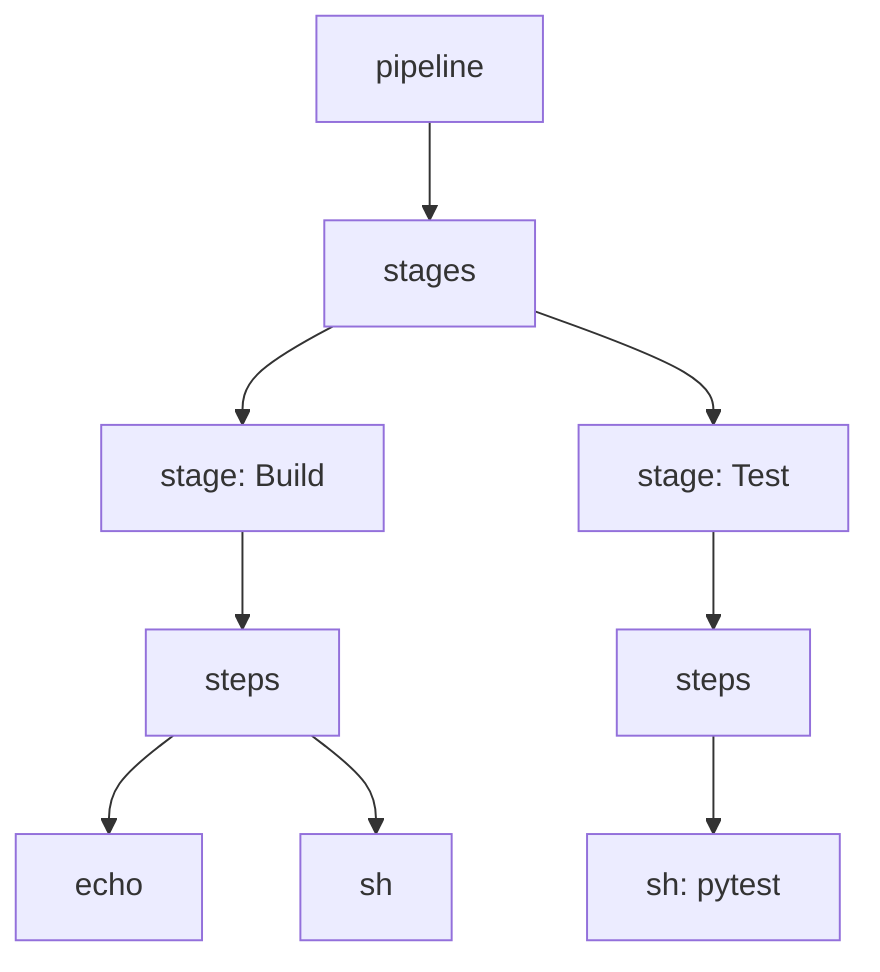

# Stages and Steps

> [!summary] TL;DR
> A **stage** is a named logical block ("Build", "Test"); a **step** is a single action inside it (`sh`, `echo`, `git`). Pipelines are made of stages, stages are made of steps.

## Hierarchy



## Stage

A stage typically maps to one phase of delivery.

```groovy
stage('Build') {
    agent { label 'linux' }
    when { branch 'main' }
    steps {
        sh 'make build'
    }
    post {
        failure { slackSend message: 'Build failed' }
    }
}
```

### Stage-level Options

| Block       | Purpose                                                |
| ----------- | ------------------------------------------------------ |
| `agent`     | Override agent for this stage.                         |
| `when`      | Skip stage based on branch / env / expression.         |
| `environment` | Stage-scoped env vars.                              |
| `steps`     | Actions to execute.                                    |
| `post`      | Run on success/failure/always.                         |
| `options`   | Stage-level options (e.g. `timeout`, `retry`).         |
| `tools`     | Auto-install JDK / Maven / Node for this stage.        |

## Step

A step is the smallest unit of work. Common built-in steps:

| Step        | Purpose                                                |
| ----------- | ------------------------------------------------------ |
| `echo`      | Print a message.                                       |
| `sh` / `bat`| Run a shell / batch command.                           |
| `git`       | Clone a repo.                                          |
| `checkout`  | More flexible SCM checkout (used in multibranch).      |
| `dir`       | Run nested steps in a different directory.             |
| `withEnv`   | Set env vars for nested steps.                         |
| `withCredentials` | Inject secrets as env or files. See [[Managing Credentials]]. |
| `junit`     | Publish xUnit test results.                            |
| `archiveArtifacts` | Save build artifacts.                            |
| `input`     | Pause for human approval.                              |
| `retry`     | Retry nested steps on failure.                         |
| `timeout`   | Fail if nested steps exceed duration.                  |
| `sleep`     | Wait.                                                  |
| `error`     | Fail the build with a message.                         |
| `script {}` | Run Scripted Pipeline Groovy inside Declarative.       |

## Common Patterns

### Run only on a branch

```groovy
stage('Deploy Prod') {
    when { branch 'main' }
    steps { sh 'make deploy-prod' }
}
```

### Timeout + Retry

```groovy
stage('Deploy') {
    options { retry(3); timeout(time: 5, unit: 'MINUTES') }
    steps { sh './deploy.sh' }
}
```

### Conditional with `when` expression

```groovy
stage('Nightly E2E') {
    when {
        triggeredBy 'TimerTrigger'
    }
    steps { sh './run-e2e.sh' }
}
```

### Use a different agent per stage

```groovy
stage('Windows build') {
    agent { label 'windows' }
    steps { bat 'build.bat' }
}
```

## Stage View

Jenkins shows a stage view with each stage's status, duration, and logs. Blue Ocean renders it graphically.


## Related Notes
- [[Pipelines]] · [[Pipeline as Code]] · [[Build Triggers]] · [[Managing Credentials]]
