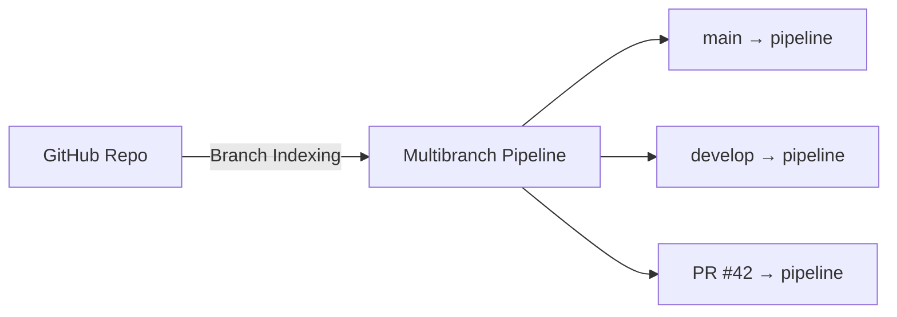
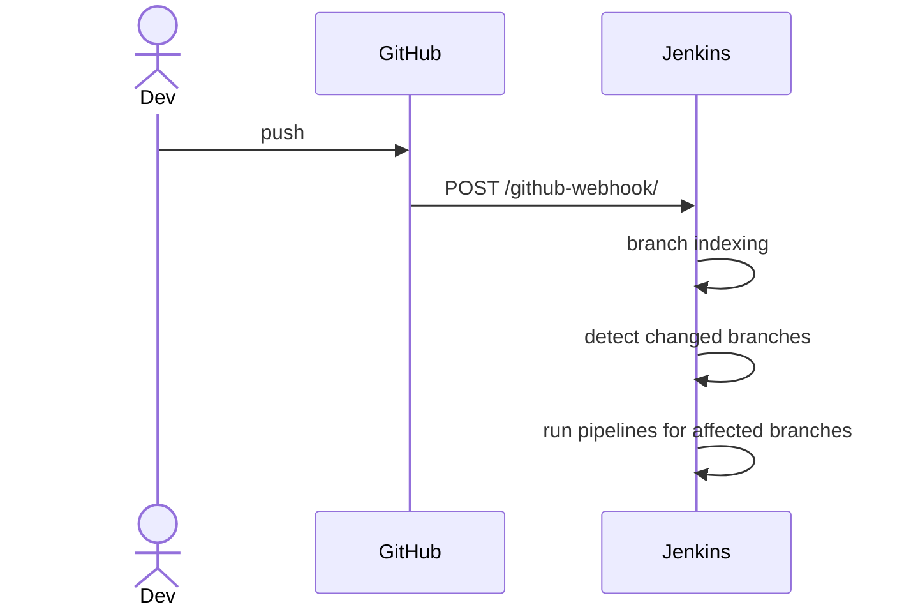

# Git Integration

> [!summary] TL;DR
> Jenkins integrates with Git via the **Git Plugin** + SCM steps. For modern setups, use **Multibranch Pipeline** with webhooks so every branch & PR gets its own pipeline.

## Ways Jenkins Uses Git

| Mechanism                       | Use case                                              |
| ------------------------------- | ----------------------------------------------------- |
| `checkout scm` in pipeline      | Default in Multibranch — auto-checks the triggering branch. |
| `git` step                      | Clone a specific repo/branch in a pipeline.           |
| Freestyle "Source Code Management" | UI-based Git config for legacy jobs.               |
| Multibranch Pipeline            | Auto-discovers branches/PRs, runs `Jenkinsfile` from each. |
| GitHub Organization folder      | Auto-discovers repos under an org.                    |

## Minimal Pipeline Checkout

```groovy
pipeline {
    agent any
    stages {
        stage('Checkout') {
            steps { checkout scm }
        }
        stage('Build') {
            steps { sh 'make build' }
        }
    }
}
```

In a **Multibranch Pipeline**, `scm` is automatically the branch/PR that triggered the build.

## Cloning a Different Repo in a Step

```groovy
stage('Pull config repo') {
    steps {
        git url: 'https://github.com/myorg/config.git',
            branch: 'main',
            credentialsId: 'github-token'
    }
}
```

## Setting Up a Multibranch Pipeline

1. **New Item → Multibranch Pipeline**.
2. **Branch Sources → Add source → GitHub**.
3. Add credentials (see [[Managing Credentials]]) if private.
4. Set the repo owner & name.
5. Under **Build Configuration**, leave Script Path as `Jenkinsfile`.
6. Save — Jenkins scans & creates a pipeline per branch.



## Webhooks (Auto-trigger)

See [[Build Triggers]] for the GitHub webhook setup. The high-level flow:



## Working with Branch, Tag, and PR

```groovy
stage('Deploy Prod') {
    when { branch 'main' }
    steps { sh 'make deploy-prod' }
}
stage('Release') {
    when { tag 'v*' }
    steps { sh 'make release' }
}
```

## Useful Snippets

```groovy
// Get current Git commit
def commit = sh(returnStdout: true, script: 'git rev-parse --short HEAD').trim()
echo "Building ${commit}"

// Get current branch
def branch = env.BRANCH_NAME
echo "On branch ${branch}"
```

## Related Notes
- [[Build Triggers]] · [[Pipeline as Code]] · [[Managing Credentials]] · [[Simple CI-CD Pipeline]]
