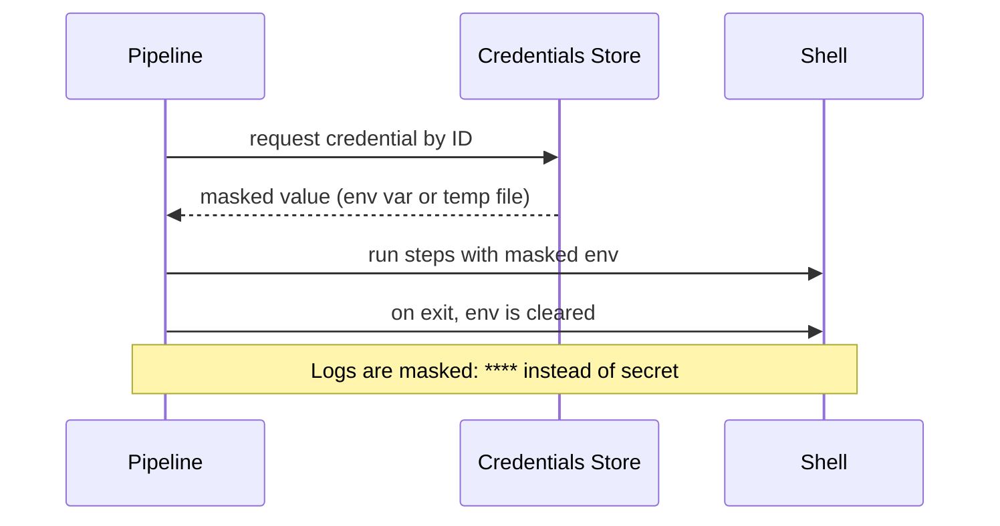

# Managing Credentials

> [!summary] TL;DR
> Jenkins stores secrets (passwords, tokens, SSH keys, certificates) in a built-in **Credentials Store**. Pipelines inject them safely via `withCredentials`.

## Where Credentials Live

**Manage Jenkins → Credentials → System → Global credentials (unrestricted)**.

## Credential Types

| Type                | Example use                                            |
| ------------------- | ----------------------------------------------------- |
| **Username + password** | Git login, API auth.                              |
| **Secret text**     | API tokens, bearer tokens.                            |
| **Secret file**     | `.npmrc`, `gcloud` service-account JSON, kubeconfig.  |
| **SSH key**         | Git over SSH.                                          |
| **Certificate (PKCS#12)** | Client certificates.                            |
| **AWS Credentials** | Access key + secret key.                              |

## Adding a Credential

1. **Manage Jenkins → Credentials → System → Global** → **Add Credentials**.
2. Pick type → fill values.
3. Set an **ID** (e.g. `dockerhub`, `github-token`) — this is what you reference in pipelines.
4. Save.

> [!important] The ID is forever
> Once other pipelines reference an ID, don't change it. Update the value (rotate) instead.

## Using Credentials in a Pipeline

### Secret text

```groovy
withCredentials([string(credentialsId: 'npm-token', variable: 'NPM_TOKEN')]) {
    sh 'npm config set //registry.npmjs.org/:_authToken=$NPM_TOKEN'
}
```

### Username + password

```groovy
withCredentials([usernamePassword(credentialsId: 'dockerhub',
                                  usernameVariable: 'U',
                                  passwordVariable: 'P')]) {
    sh '''
      echo "$P" | docker login -u "$U" --password-stdin
      docker push myorg/app:latest
    '''
}
```

### SSH key

```groovy
withCredentials([sshUserPrivateKey(credentialsId: 'github-ssh',
                                   keyFileVariable: 'KEY',
                                   usernameVariable: 'USER')]) {
    sh '''
      export GIT_SSH_COMMAND="ssh -i $KEY -o StrictHostKeyChecking=no"
      git clone git@github.com:myorg/repo.git
    '''
}
```

### Secret file

```groovy
withCredentials([file(credentialsId: 'kubeconfig', variable: 'KUBECONFIG_FILE')]) {
    sh "KUBECONFIG=$KUBECONFIG_FILE kubectl apply -f deploy.yaml"
}
```

## What `withCredentials` Does



> [!warning] Don't `echo` secrets
> Even though Jenkins masks them in logs, avoid printing. Some shells/tools may leak them via error messages.

## Best Practices

-  Use **Secret text** for tokens, not **Username/password** with a fake username.
-  Scope credentials to the folder/domain if possible.
-  Rotate regularly.
-  Use **Credentials Binding** plugin — never paste secrets directly into `Jenkinsfile`.
-  For cloud-native setups, consider **HashiCorp Vault Plugin** or **AWS Secrets Manager**.

## Related Notes
- [[Pipeline as Code]] · [[Stages and Steps]] · [[Git Integration]] · [[Best Practices for Beginners]]
