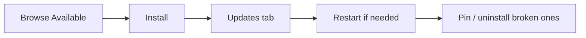

# Plugins

> [!summary] TL;DR
> **Plugins** are how Jenkins extends its capabilities — Git, Docker, Kubernetes, Slack, SonarQube, AWS, Azure… 1,800+ are available. Install and manage them via **Manage Jenkins → Plugins**.

## Where Plugins Come From

The Jenkins update center at <https://plugins.jenkins.io>. Browse, search, and read docs there.

## Installing a Plugin

1. **Manage Jenkins → Plugins → Available plugins**.
2. Search (e.g. "Docker Pipeline").
3. Check the box → **Install**.
4. Restart Jenkins if prompted (some plugins need it).

Or via CLI:

```bash
jenkins-plugin-cli --plugins docker-workflow:580.vc0c938cb773                               kubernetes:4174.v4230d0ccd95d
```

## Essential Plugins (Starter Kit)

| Plugin                    | Why you need it                                       |
| ------------------------- | ----------------------------------------------------- |
| **Git Plugin**            | Clone repos, branch discovery.                        |
| **Pipeline**              | Modern pipelines (Declarative + Scripted).            |
| **Git Parameter Plugin**  | Let users pick a branch/tag at build time.            |
| **Credentials Binding**   | Inject secrets safely into builds.                    |
| **Docker Pipeline**       | `docker.image(...)` and `agent { docker '...' }`.     |
| **Kubernetes Plugin**     | Run pipeline agents as Pods.                          |
| **Blue Ocean**            | Modern pipeline UI & visual editor.                   |
| **Workspace Cleanup**     | `cleanWs()` between builds.                           |
| **Timestamper**           | Timestamps in logs.                                   |
| **ANSI Color**            | Colored console output.                               |
| **Job DSL**               | Define jobs in code.                                  |
| **Configuration as Code (JCasC)** | Declarative Jenkins configuration.           |

## Managing Plugins



- **Updates tab** — newer versions of installed plugins.
- **Installed tab** — disable / uninstall.
- **Advanced tab** — upload `.hpi` file manually, set proxy, update site URL.

## Plugin Tips

-  Don't install everything — more plugins = more upgrade risk.
-  Read release notes before upgrading major plugins.
-  Test plugin upgrades on a staging Jenkins first.
-  Use JCasC to version-control plugin lists.
-  Restart cleanly: `Manage Jenkins → Restart`.

## When Plugins Break

- Disable recently-updated plugins from **Installed** tab.
- Check **Manage Jenkins → System Log** for exceptions.
- Roll back via the plugin's version dropdown on its page at plugins.jenkins.io.

## Related Notes
- [[Installation and Setup]] · [[Git Integration]] · [[Managing Credentials]] · [[Best Practices for Beginners]]
