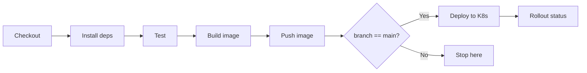

# Simple CI/CD Pipeline

> [!summary] TL;DR
> A complete walkthrough: build a Python web app, run tests, build a Docker image, push it, and deploy to a Kubernetes cluster.

## Prerequisites

- Jenkins running (see [[Installation and Setup]]).
- **Docker Pipeline** plugin installed.
- A Docker registry account (Docker Hub or private).
- A Kubernetes cluster with kubeconfig as a Jenkins credential (see [[Managing Credentials]]).
- A sample app with `app.py`, `requirements.txt`, `tests/`, `Dockerfile`.

## Repo Layout

```text
my-flask-app/
├── app.py
├── requirements.txt
├── tests/
│   └── test_app.py
├── Dockerfile
└── Jenkinsfile
```

## The `Jenkinsfile`

```groovy
pipeline {
    agent any

    environment {
        IMAGE = "myorg/flask-app:${env.BUILD_NUMBER}"
    }

    options {
        timestamps()
        timeout(time: 20, unit: 'MINUTES')
        buildDiscarder(logRotator(numToKeepStr: '10'))
    }

    stages {
        stage('Checkout') {
            steps { checkout scm }
        }

        stage('Install deps') {
            steps {
                sh 'python -m venv .venv && . .venv/bin/activate && pip install -r requirements.txt'
            }
        }

        stage('Test') {
            steps {
                sh '. .venv/bin/activate && pytest -q --junitxml=reports/test.xml'
            }
            post { always { junit 'reports/test.xml' } }
        }

        stage('Build image') {
            steps {
                sh 'docker build -t $IMAGE .'
            }
        }

        stage('Push image') {
            steps {
                withCredentials([usernamePassword(credentialsId: 'dockerhub',
                                                  usernameVariable: 'U',
                                                  passwordVariable: 'P')]) {
                    sh '''
                      echo "$P" | docker login -u "$U" --password-stdin
                      docker push $IMAGE
                    '''
                }
            }
        }

        stage('Deploy to K8s') {
            when { branch 'main' }
            steps {
                withCredentials([file(credentialsId: 'kubeconfig', variable: 'KUBECONFIG_FILE')]) {
                    sh '''
                      KUBECONFIG=$KUBECONFIG_FILE kubectl set image deploy/flask app=$IMAGE
                      KUBECONFIG=$KUBECONFIG_FILE kubectl rollout status deploy/flask
                    '''
                }
            }
        }
    }

    post {
        always   { cleanWs() }
        success  { echo "Build #${env.BUILD_NUMBER} succeeded: ${env.BUILD_URL}" }
        failure  { echo "Build failed, see logs." }
    }
}
```

## Pipeline Flow



## Walkthrough

| Stage       | What happens                                                       |
| ----------- | ----------------------------------------------------------------- |
| Checkout    | `checkout scm` clones the triggering branch.                       |
| Install deps| Create venv, install requirements.                                 |
| Test        | Run `pytest`, publish JUnit XML for the Jenkins UI.                |
| Build image | `docker build` produces a local image tagged with the build #.     |
| Push image  | Log into Docker Hub with stored credentials, push image.          |
| Deploy      | On `main` only: update the K8s Deployment's image and wait for rollout. |

## Setting It Up

1. Create a **Multibranch Pipeline** job pointing at your repo.
2. Add a `dockerhub` credential (username + password).
3. Add a `kubeconfig` credential (secret file containing your kubeconfig).
4. Push to `main`. Watch the pipeline run.
5. Open a PR — the pipeline runs up to "Push image" (no deploy).

## Extending It

- **Lint**: add `sh 'flake8 app.py tests/'`.
- **Security scan**: add `sh 'trivy image $IMAGE'`.
- **Manual approval before prod**: insert `input message: 'Deploy?'` before the Deploy stage.
- **Notifications**: add `slackSend` in `post`.

## Related Notes
- [[Pipeline as Code]] · [[Stages and Steps]] · [[Managing Credentials]] · [[Best Practices for Beginners]]
