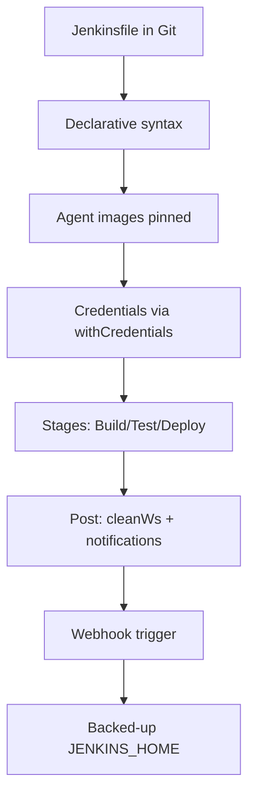

# Best Practices for Beginners

> [!summary] TL;DR
> Practical, opinionated rules to start Jenkins on the right foot.

## 1. Always Use Pipelines (Not Freestyle)

Freestyle jobs live only in the UI. Pipelines live in your Git repo — version-controlled, reviewable, reproducible. See [[Pipelines]] and [[Pipeline as Code]].

## 2. Use Multibranch Pipeline for New Projects

Every branch & PR gets its own pipeline. No manual job-per-branch clutter.

## 3. Keep `Jenkinsfile` Short and Declarative

- Use **Declarative** syntax by default.
- Push complex logic into shell scripts committed to the repo.
- Use shared libraries for cross-project duplication.

## 4. Never Hard-Code Secrets

Use [[Managing Credentials]] and `withCredentials`. Rotate regularly.

## 5. Pin Tools and Image Versions

 `agent { docker 'node' }`
 `agent { docker 'node:20-alpine3.20' }`

Same for JDK, Maven, Gradle.

## 6. Always Use `agent any` Initially, Then Specialize

Start simple. Add labels only when you need OS-specific stages.

## 7. Set `options` for Reliability

```groovy
options {
    timestamps()
    timeout(time: 20, unit: 'MINUTES')
    buildDiscarder(logRotator(numToKeepStr: '20'))
    ansiColor('xterm')
}
```

## 8. Use `post` for Cleanup & Notifications

```groovy
post {
    always   { cleanWs(); junit 'reports/**/*.xml' }
    failure  { slackSend message: "Build failed: ${env.BUILD_URL}" }
}
```

## 9. Don't Run Heavy Builds on the Controller

Run them on agents — see [[Jenkins Architecture]]. The controller should stay responsive.

## 10. Back Up `JENKINS_HOME`

Schedule regular backups of `JENKINS_HOME`. For Docker, mount a persistent volume.

## 11. Be Careful with Plugin Updates

- Test on staging first.
- Read release notes.
- Don't update everything at once.

## 12. Use Configuration as Code (JCasC)

Version-control Jenkins itself: jobs, credentials, security, tool installs. Reconstructable from Git.

## 13. Use Webhooks, Not Polling

Polling wastes cycles and adds latency. See [[Build Triggers]].

## 14. Make Builds Reproducible

- No "it only works on Bob's laptop".
- Use containers for builds.
- Capture tool versions.

## 15. Add Observability

- **Metrics**: Prometheus plugin.
- **Logs**: forward to ELK / Loki.
- **Alerts**: notify Slack/Teams on failures.

## Checklist for a Healthy Pipeline



## Related Notes
- [[Pipeline as Code]] · [[Simple CI-CD Pipeline]] · [[Common Terminology]] · [[Shared/readme]]
