#  Jenkins Basics

> [!info] Welcome
> This vault is a beginner-friendly guide to Jenkins — the open-source automation server for CI/CD. Open any note below or follow links inside notes to explore.

##  Map of Content

### 1. Introduction
- [[What is Jenkins]]
- [[Why Jenkins]]

### 2. Setup
- [[Installation and Setup]]
- [[Jenkins Architecture]]
- [[Dashboard Overview]]

### 3. Core Concepts
- [[Jobs]]
- [[Pipelines]]
- [[Pipeline as Code]]
- [[Stages and Steps]]
- [[Build Triggers]]

### 4. Configuration
- [[Plugins]]
- [[Git Integration]]
- [[Managing Credentials]]

### 5. Practice
- [[Simple CI-CD Pipeline]]

### 6. Reference
- [[Common Terminology]]
- [[Best Practices for Beginners]]

---

##  Suggested Learning Path

```mermaid
flowchart LR
    A[What is Jenkins?] --> B[Why Jenkins]
    B --> C[Installation & Setup]
    C --> D[Jenkins Architecture]
    D --> E[Dashboard Overview]
    E --> F[Jobs]
    F --> G[Pipelines]
    G --> H[Pipeline as Code]
    H --> I[Stages & Steps]
    I --> J[Build Triggers]
    J --> K[Plugins & Git]
    K --> L[Credentials]
    L --> M[Simple CI/CD Pipeline]
    M --> N[Best Practices]
```

##  Quick Start

1. Run Jenkins locally with Docker: `docker run -d -p 8080:8080 -p 50000:50000 jenkins/jenkins:lts`.
2. Read [[What is Jenkins]] and [[Why Jenkins]].
3. Open the [[Dashboard Overview]] once Jenkins is running.
4. Build your first pipeline with [[Simple CI-CD Pipeline]].
