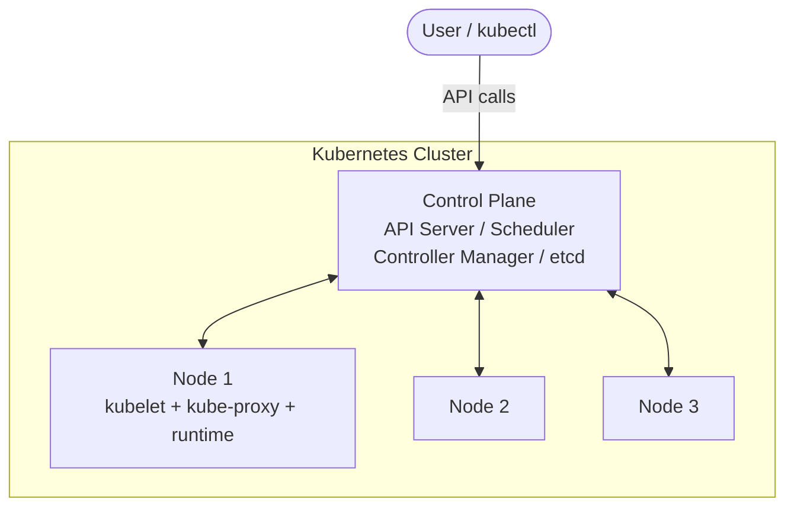
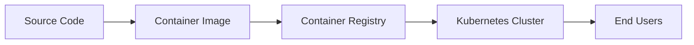

# What is Kubernetes?

> [!summary] TL;DR
> **Kubernetes (K8s)** is an open-source platform for automating the deployment, scaling, and operation of containerized applications across a cluster of machines.

## Definition

Kubernetes is a **container orchestration system** originally developed at Google (based on their internal system "Borg") and donated to the **Cloud Native Computing Foundation (CNCF)** in 2014. The name comes from the Greek word for "helmsman" or "pilot" — the person steering the ship. The 8 in "K8s" replaces the 8 letters between K and s.

In simple terms, while **Docker** lets you run a single container on a single machine, **Kubernetes** lets you run thousands of containers across many machines, keeping them healthy, connected, and scaled to demand.

## What Problem It Solves

Without orchestration, running containers in production means manually:

- Starting and stopping containers on each server.
- Restarting them when they crash.
- Distributing load across machines.
- Re-balancing when a machine fails.
- Scaling up during traffic spikes.

Kubernetes automates all of this and more.

## Key Capabilities

| Capability                | Description                                                              |
| ------------------------- | ------------------------------------------------------------------------ |
| **Self-healing**          | Restarts failed containers, replaces and reschedules pods on dead nodes. |
| **Horizontal scaling**    | Scales apps up/down manually or automatically based on CPU/memory.       |
| **Automated rollouts**    | Progressive deployment and rollback of new versions.                     |
| **Service discovery**     | Built-in DNS and load balancing for services.                            |
| **Storage orchestration** | Mounts persistent storage from local, cloud, or network providers.       |
| **Secret/config mgmt**    | Manages sensitive data and configuration without rebuilding images.      |

## High-Level View

## Where It Fits

## Related Notes
- [[Why Kubernetes]]
- [[Core Architecture]]
- [[Clusters]]
- [[Common Terminology]]
