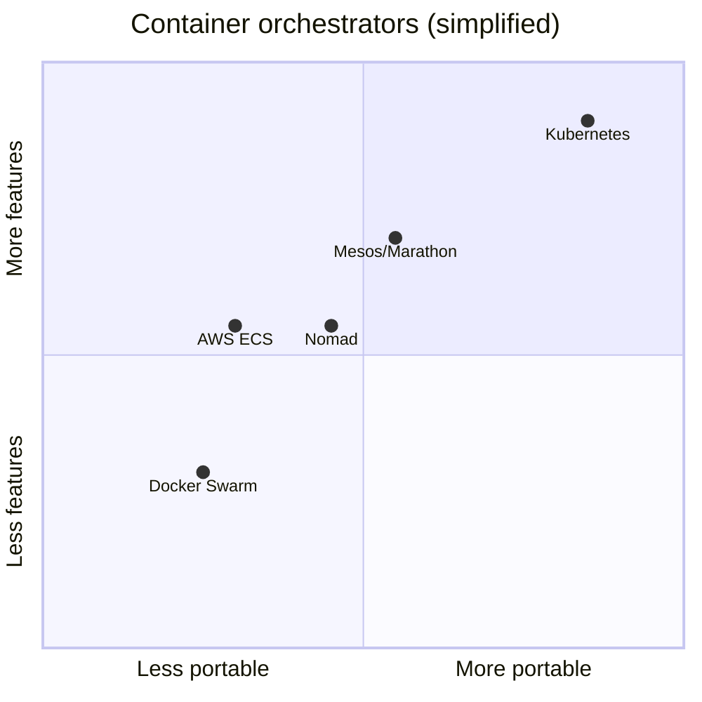

# Why Kubernetes

> [!summary] TL;DR
> Kubernetes exists because running containers by hand at scale is impossible — it automates scaling, healing, deployment, and discovery so teams can ship reliably.

## The "Before" Picture

Before container orchestrators, teams typically deployed applications using one of these approaches:

1. **Manual deployments** — SSH into servers, copy binaries, restart services.
2. **Bash/SSH scripts** — fragile, hard to reproduce.
3. **Virtual machines with config mgmt** (Chef/Puppet/Ansible) — heavy, slow boot.
4. **Platform-as-a-Service** (Heroku, Elastic Beanstalk) — easy but locked-in and limited.

When containers (Docker) arrived, they solved the "it works on my machine" problem — but introduced a new one: **how do you run 5,000 containers across 200 servers and keep them all alive?**

## The Core Problems Kubernetes Solves

| Problem without K8s                     | How K8s helps                                  |
| --------------------------------------- | ---------------------------------------------- |
| Containers crash silently               | Auto-restart & reschedule ([[Pods]])           |
| Traffic must reach healthy instances    | [[Services]] + built-in load balancing         |
| Traffic spikes overload servers         | Horizontal Pod Autoscaler ([[Basic Scaling]])  |
| Rolling out new versions is risky       | [[Deployments]] with rolling updates + rollback|
| Hard to manage secrets/configs          | [[ConfigMaps and Secrets]]                     |
| Need data to survive container restarts | [[Volumes]] (Persistent Volumes)               |
| Multi-team shared cluster is messy      | [[Namespaces]] for logical isolation           |
| Bin-packing containers onto nodes       | Scheduler picks best node automatically        |

## Why Teams Choose K8s Over Alternatives

- **Portability** — runs on AWS, GCP, Azure, on-prem, or your laptop.
- **Ecosystem** — the CNCF ecosystem (Helm, Istio, Prometheus, ArgoCD, etc.) is enormous.
- **De facto standard** — most cloud providers offer managed Kubernetes (EKS, GKE, AKS).
- **Vendor-neutral API** — your manifests work everywhere.

## When NOT to Use Kubernetes

> [!warning] K8s isn't always the answer
> - You run a single long-lived app with low traffic.
> - Your team has < 3 engineers and no DevOps capacity.
> - Your deploy cadence is once a month.
> - You need a single VM, not a cluster.
> In those cases, consider Docker Compose, a PaaS (Heroku/Render/Fly.io), or a single VM.

## Trade-offs to Know Up Front

-  **Steep learning curve** — many abstractions (Pods, Deployments, Services, Ingress...).
-  **Operational overhead** — upgrades, backups of etcd, monitoring, RBAC.
-  **Resource cost** — control plane has its own footprint.
-  **YAML fatigue** — manifests can get long; tools like Helm/Kustomize help.

## Related Notes
- [[What is Kubernetes]]
- [[Core Architecture]]
- [[Best Practices for Beginners]]
