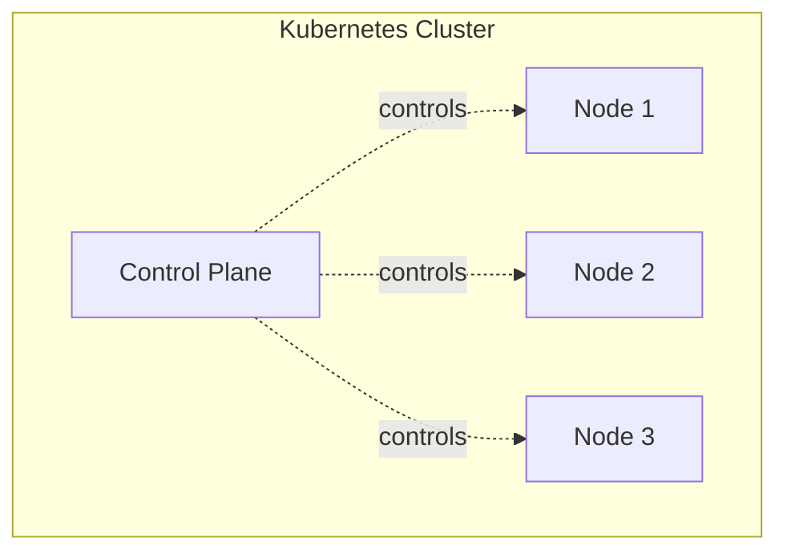
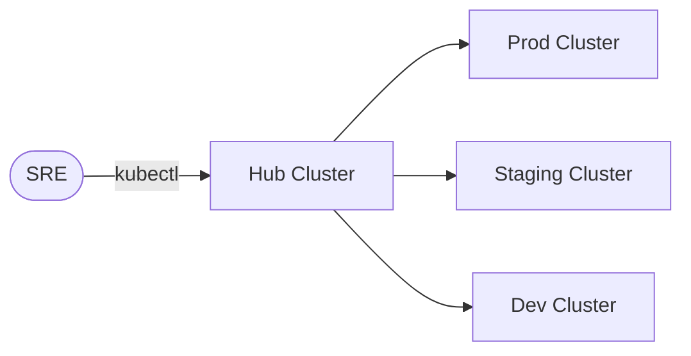

# Clusters

> [!summary] TL;DR
> A **cluster** is the full Kubernetes installation: one Control Plane plus one or more worker Nodes, all sharing one `etcd` source of truth.

## What Is a Cluster?

A cluster is the top-level unit in Kubernetes. It contains:

- A **Control Plane** (decision maker).
- A set of **Worker Nodes** (where Pods run).
- A shared **`etcd`** data store.
- A **network** that connects all nodes and allows Pod-to-Pod traffic.



## Types of Clusters You'll Meet

| Type                | Description                                                                       | Example                          |
| ------------------- | --------------------------------------------------------------------------------- | -------------------------------- |
| **Local/Dev**       | Single-node cluster on your laptop for learning.                                  | minikube, kind, k3d, Docker Desktop |
| **Self-managed**    | You install & operate everything (control plane + nodes).                         | kubeadm, kubespray, RKE          |
| **Managed**         | Cloud provider runs the control plane; you manage only the worker nodes.          | EKS (AWS), GKE (GCP), AKS (Azure) |
| **Edge / lightweight** | Stripped-down Kubernetes for IoT/edge.                                         | k3s, MicroK8s                    |

## Cluster Contexts (kubectl)

You switch between clusters using **contexts** stored in `~/.kube/config`:

```bash
# List configured clusters
kubectl config get-clusters

# List contexts (cluster + user + namespace)
kubectl config get-contexts

# Switch context
kubectl config use-context my-eks-cluster

# Show current context
kubectl config current-context
```

## Multi-Cluster Patterns



- **Hub-and-spoke** — one cluster manages many (e.g. ArgoCD, Cluster API).
- **Active/Active** — traffic split across regions.
- **Active/Passive** — DR failover.

> [!tip] Beginners don't need multi-cluster
> Start with one local cluster (kind or minikube). Multi-cluster is an advanced topic.

## Related Notes
- [[Core Architecture]]
- [[Nodes]]
- [[Kubectl Commands]]
- [[Namespaces]] (logical separation *within* a cluster)
