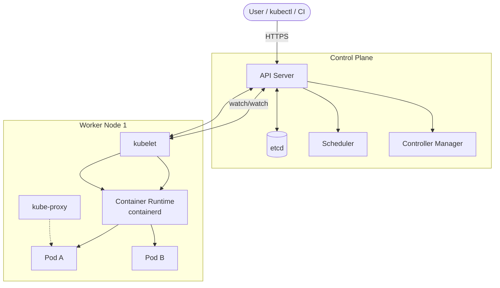
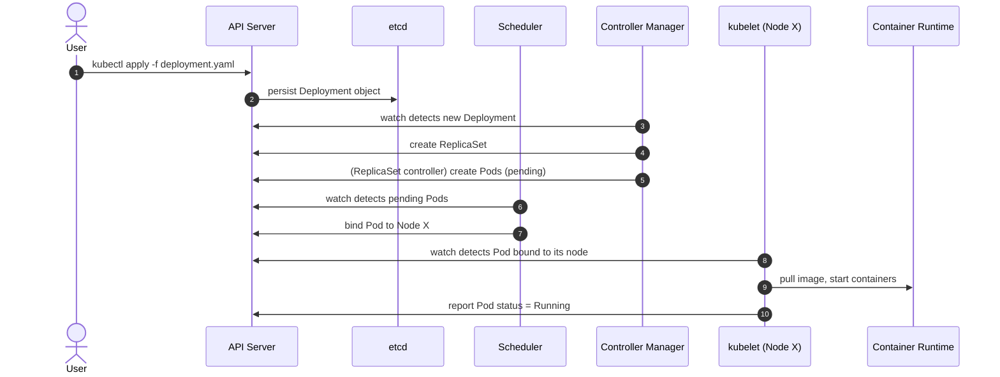

# Core Architecture

> [!summary] TL;DR
> A Kubernetes cluster has two main parts: the **Control Plane** (the "brain") and **Worker Nodes** (the "muscle"). They communicate via the API Server.

## High-Level Architecture

## Control Plane Components

| Component                  | Role                                                                         |
| -------------------------- | ----------------------------------------------------------------------------- |
| **API Server** (`kube-apiserver`) | The front door. All components and users talk to it over REST/HTTPS.    |
| **etcd**                   | Strongly-consistent key-value store. Source of truth for cluster state.      |
| **Scheduler** (`kube-scheduler`) | Decides which node a new Pod runs on based on resources, taints, etc.   |
| **Controller Manager**     | Runs control loops (replica set, node, deployment, endpoint controllers).    |
| **Cloud Controller Manager** | Optional; integrates with cloud provider APIs (load balancers, volumes).    |

> [!note] Source of truth
> `etcd` is the **only** place cluster state lives. If you lose etcd without a backup, you lose the cluster.

## Worker Node Components

| Component                | Role                                                                            |
| ------------------------ | -------------------------------------------------------------------------------- |
| **kubelet**              | Agent on each node. Talks to API server, ensures pods are running & healthy.    |
| **kube-proxy**           | Maintains network rules for [[Services]] (iptables / IPVS).                     |
| **Container Runtime**    | Runs containers. Usually **containerd** (formerly Docker). CRI-compatible.      |
| **Pods**                 | The smallest deployable unit. See [[Pods]].                                     |

## How a Request Flows (Deployment example)

## Concepts Recap

- [[Clusters]] — the whole thing (control plane + nodes).
- [[Nodes]] — individual machines (or VMs).
- [[Pods]] — what actually runs your containers.

## Related Notes
- [[Clusters]] · [[Nodes]] · [[Pods]] · [[Common Terminology]]
