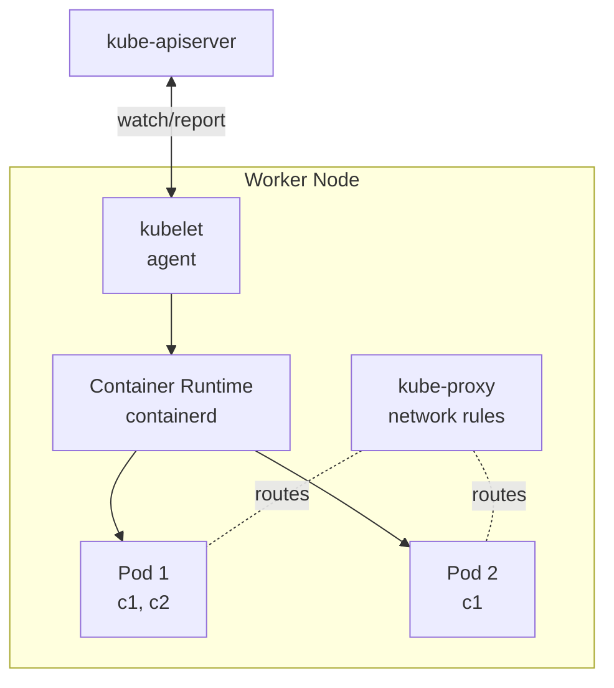

# Nodes

> [!summary] TL;DR
> A **Node** is a single machine (VM or physical) in a cluster. It runs the `kubelet`, `kube-proxy`, and a container runtime, and hosts one or more [[Pods]].

## What's on a Node?



## Node Components

| Component          | Purpose                                                                    |
| ------------------ | -------------------------------------------------------------------------- |
| **kubelet**        | Talks to API server; ensures pods are healthy; reports node status.        |
| **kube-proxy**     | Programs iptables/IPVS so Service IPs route to Pod IPs.                    |
| **Container runtime** | Runs containers (containerd, CRI-O). Communicates via CRI.              |
| **Pods**           | The workloads. See [[Pods]].                                               |

## Two Flavors of Nodes

- **Worker Nodes** — run user workloads.
- **Control-Plane Nodes** — run API server, etcd, scheduler, controllers.

> [!note] In dev clusters (minikube, kind), one node often plays both roles.

## Inspecting Nodes

```bash
# List nodes
kubectl get nodes

# Wide view with IP, OS, kernel, runtime
kubectl get nodes -o wide

# Detailed info about a node (capacity, conditions, taints)
kubectl describe node <node-name>

# Resource usage (needs metrics-server)
kubectl top nodes
```

## Sample `kubectl describe node` Output

```text
Name:               kind-worker
Roles:              <none>
Labels:             kubernetes.io/hostname=kind-worker
Capacity:
  cpu:                8
  memory:             16336312Ki
  pods:               110
Conditions:
  Type              Status  LastHeartbeatTime
  Ready             True    2026-06-27T10:00:00Z
Taints:             <none>
```

## Node Conditions (Health)

| Condition            | Meaning                                                |
| -------------------- | ------------------------------------------------------ |
| `Ready`              | Node can accept pods.                                  |
| `DiskPressure`       | Low disk space.                                        |
| `MemoryPressure`     | Low memory.                                            |
| `PIDPressure`        | Too many processes.                                    |
| `NetworkUnavailable` | Network misconfigured.                                 |

## Taints & Tolerations (Beginner Overview)

- A **taint** on a node repels pods (e.g. `NoSchedule`).
- A **toleration** on a pod allows it to land on a tainted node.
- Use case: dedicate GPU nodes to ML workloads.

```bash
# Add a taint
kubectl taint node gpu-node dedicated=gpu:NoSchedule
```

## Related Notes
- [[Clusters]]
- [[Pods]]
- [[Core Architecture]]
- [[Basic Scaling]]
