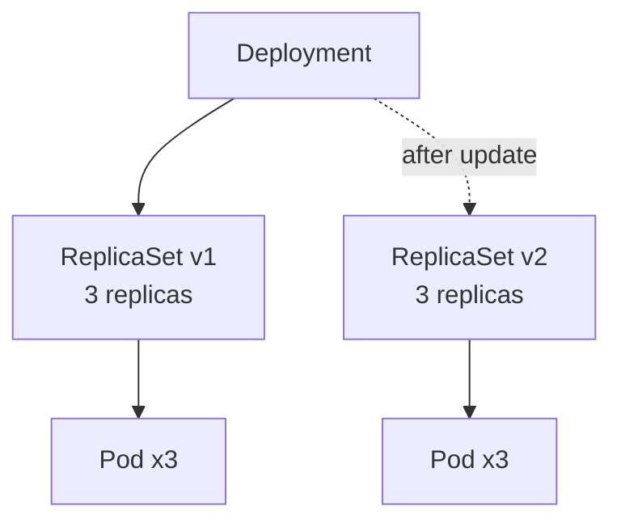
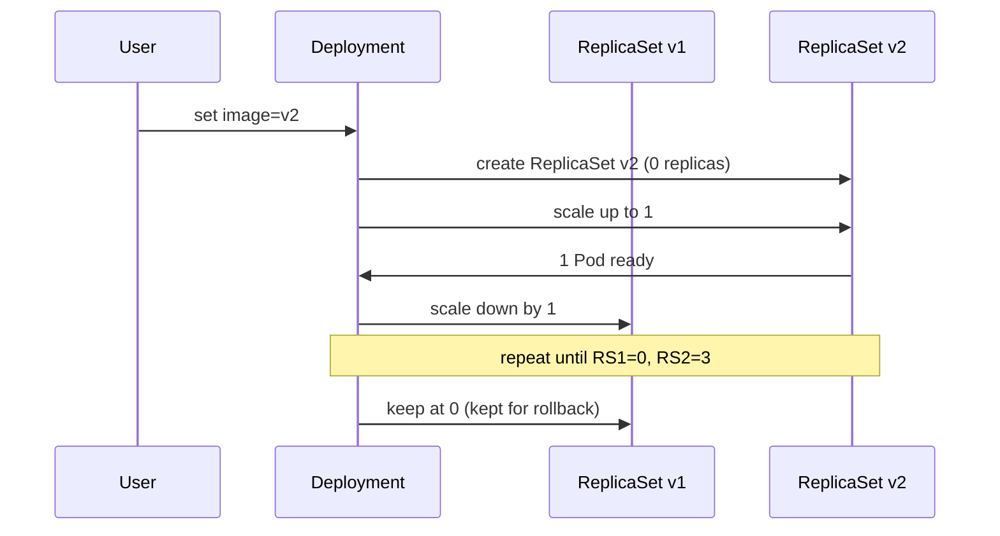

# Deployments

> [!summary] TL;DR
> A **Deployment** manages a rolling, versioned set of [[Pods]]. You almost never run bare Pods — you run a Deployment.

## What a Deployment Does

- Declares the **desired state** (image, replicas, ports, env).
- Creates a [[ReplicaSets|ReplicaSet]] to maintain the desired replica count.
- Performs **rolling updates** when you change the Pod template.
- Allows **rollbacks** to a previous revision.



## Minimal Deployment Manifest

```yaml
apiVersion: apps/v1
kind: Deployment
metadata:
  name: hello-deploy
spec:
  replicas: 3
  selector:
    matchLabels: { app: hello }
  strategy:
    type: RollingUpdate
    rollingUpdate:
      maxSurge: 1
      maxUnavailable: 0
  template:
    metadata:
      labels: { app: hello }
    spec:
      containers:
        - name: app
          image: nginx:1.27-alpine
          ports: [ { containerPort: 80 } ]
          readinessProbe:
            httpGet: { path: /, port: 80 }
```

## Common Operations

```bash
# Apply
kubectl apply -f deploy.yaml

# Scale replicas
kubectl scale deploy/hello-deploy --replicas=5

# Update image (triggers rolling update)
kubectl set image deploy/hello-deploy app=nginx:1.28-alpine

# Watch rollout
kubectl rollout status deploy/hello-deploy

# View rollout history
kubectl rollout history deploy/hello-deploy

# Rollback to previous revision
kubectl rollout undo deploy/hello-deploy

# Rollback to specific revision
kubectl rollout undo deploy/hello-deploy --to-revision=2

# Restart (forces re-pull, keeps manifest)
kubectl rollout restart deploy/hello-deploy
```

## Update Strategies

| Strategy          | Behavior                                                                |
| ----------------- | ----------------------------------------------------------------------- |
| `RollingUpdate`   | Default. Gradually replaces old Pods with new ones. No downtime if probes are healthy. |
| `Recreate`        | Kills all old Pods before starting new ones. Causes brief downtime.     |

## Rolling Update Visualized



## Best Practices

-  Always set `readinessProbe` so rolling updates don't route to broken Pods.
-  Set `resources.requests` and `resources.limits` to enable proper scheduling.
-  Pin image tags (avoid `:latest`).
-  Use `kubectl rollout undo` rather than editing back manually.

## Related Notes
- [[Pods]] · [[ReplicaSets]] · [[Basic Scaling]] · [[Services]] · [[Best Practices for Beginners]]
