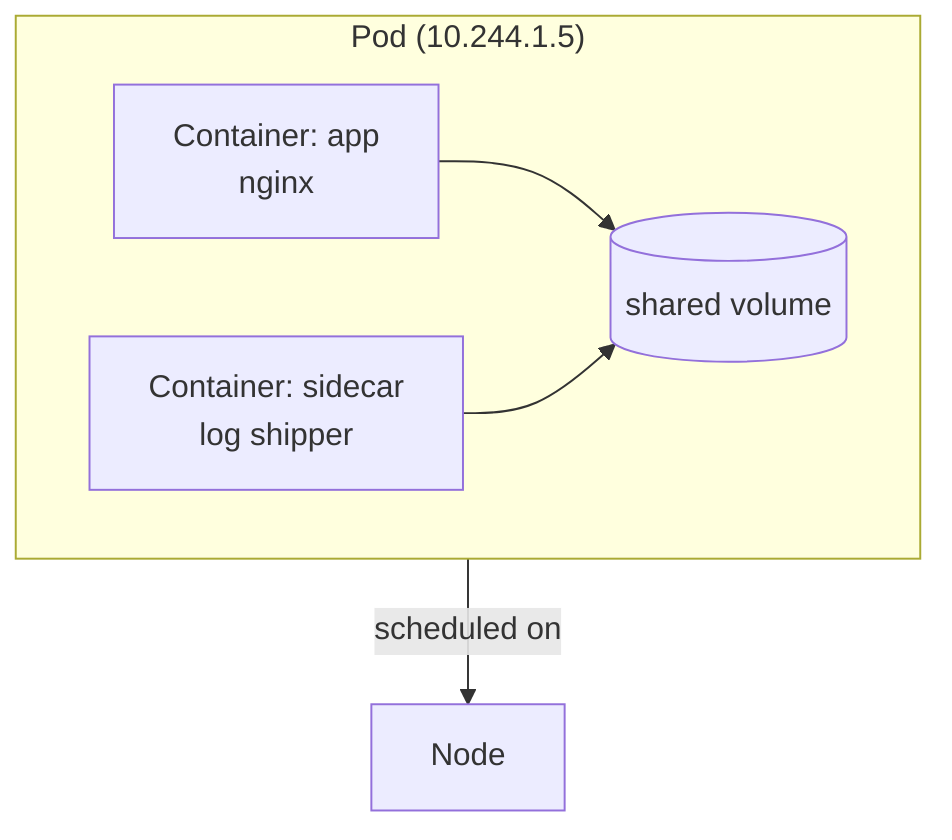
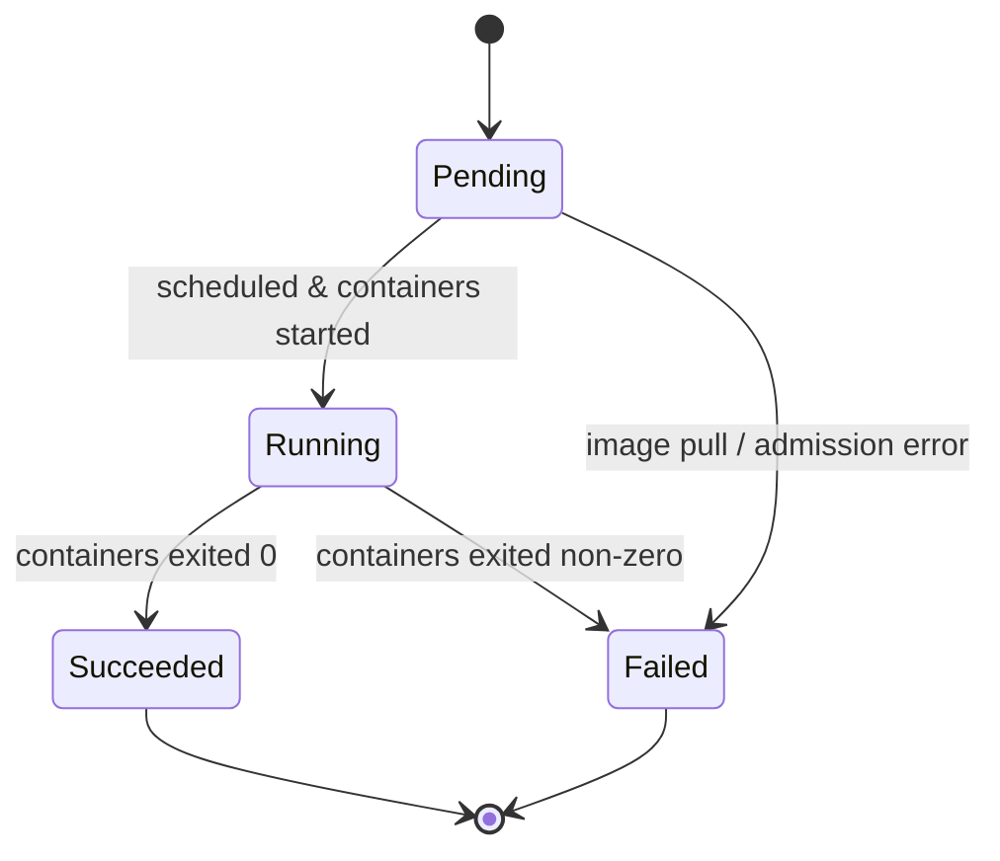

# Pods

> [!summary] TL;DR
> A **Pod** is the smallest deployable unit in Kubernetes — one or more containers that share network and storage and run together on a single [[Nodes|Node]].

## What Is a Pod?

A Pod wraps one (usually) or more containers and gives them:

- A **shared network** — same IP, same port space.
- **Shared storage volumes**.
- A **shared lifecycle** — they start, schedule, and die together.



> [!important] Pods are mortal
> Pods are **not** meant to be created or healed individually. Always use a [[Deployments|Deployment]] (or [[ReplicaSets]], StatefulSet, Job, etc.) to manage them.

## Minimal Pod Manifest

```yaml
apiVersion: v1
kind: Pod
metadata:
  name: hello-pod
  labels:
    app: hello
spec:
  containers:
    - name: app
      image: nginx:1.27-alpine
      ports:
        - containerPort: 80
      resources:
        requests: { cpu: "50m", memory: "64Mi" }
        limits:   { cpu: "200m", memory: "128Mi" }
```

## Running a Pod

```bash
# Imperative (good for learning only)
kubectl run hello-pod --image=nginx:1.27-alpine

# Declarative (preferred)
kubectl apply -f hello-pod.yaml

# See pods
kubectl get pods
kubectl get pods -o wide
kubectl describe pod hello-pod

# Logs
kubectl logs hello-pod
kubectl logs -f hello-pod   # follow

# Execute inside
kubectl exec -it hello-pod -- sh

# Delete
kubectl delete pod hello-pod
```

## Multi-Container Pod Patterns

| Pattern          | When to use                                                       |
| ---------------- | ----------------------------------------------------------------- |
| **Sidecar**      | Helper for the main container (logging, proxy, metrics).          |
| **Ambassador**   | Acts as a proxy to the outside world.                             |
| **Adapter**      | Normalizes the main container's output (e.g. monitor format).     |

## Pod Lifecycle & Phases



| Phase        | Meaning                                                          |
| ------------ | ---------------------------------------------------------------- |
| `Pending`    | Created, waiting to be scheduled or pulling images.              |
| `Running`    | At least one container still running.                            |
| `Succeeded`  | All containers exited 0 (won't restart).                         |
| `Failed`     | All containers terminated, at least one non-zero.                |
| `Unknown`    | State can't be determined (usually node communication failure).  |

## Probes (Health Checks)

- **livenessProbe** — restart container if it fails.
- **readinessProbe** — remove Pod from Service endpoints if it fails.
- **startupProbe** — wait for slow-starting apps before liveness kicks in.

```yaml
livenessProbe:
  httpGet: { path: /healthz, port: 8080 }
  initialDelaySeconds: 10
  periodSeconds: 5
readinessProbe:
  httpGet: { path: /ready, port: 8080 }
  periodSeconds: 5
```

## Related Notes
- [[Deployments]] · [[ReplicaSets]] · [[Nodes]] · [[Services]] · [[Common Terminology]]
