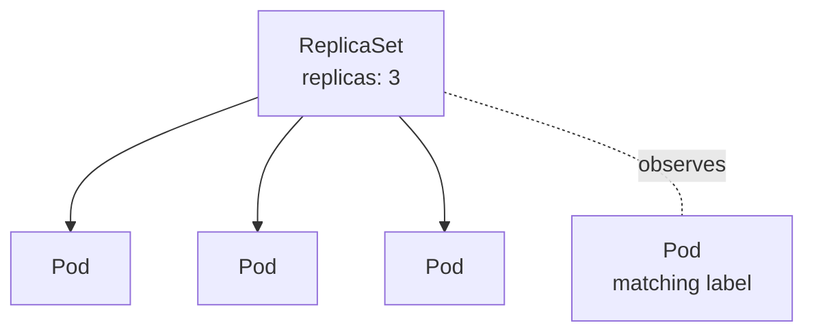

# ReplicaSets

> [!summary] TL;DR
> A **ReplicaSet** keeps a stable number of identical [[Pods]] running. You usually don't create one directly — a [[Deployments|Deployment]] creates one for you.

## What It Does

- Maintains `N` replicas of a Pod matching its selector.
- Creates new Pods when missing.
- Removes extra Pods when too many.
- Does **not** perform rolling updates — that's the Deployment's job.



## Manifest Example

```yaml
apiVersion: apps/v1
kind: ReplicaSet
metadata:
  name: hello-rs
spec:
  replicas: 3
  selector:
    matchLabels: { app: hello }
  template:
    metadata:
      labels: { app: hello }
    spec:
      containers:
        - name: app
          image: nginx:1.27-alpine
```

> [!warning] Don't manage ReplicaSets by hand
> Use a [[Deployments|Deployment]] instead. It owns a ReplicaSet and adds rolling updates + rollback. Manage ReplicaSets directly only when you have a specific reason.

## Deployment vs ReplicaSet vs Pod

| Object        | Manages replicas? | Rolling updates? | Rollback? | Use directly?                 |
| ------------- | ----------------- | ---------------- | --------- | ----------------------------- |
| [[Pods\|Pod]] | No                | No               | No        | Learning / debugging only.    |
| ReplicaSet    | Yes               | No               | No        | Rarely.                       |
| Deployment    | Yes (via RS)      | Yes              | Yes       |  Default choice.            |

## Useful Commands

```bash
kubectl get rs
kubectl describe rs hello-rs
kubectl scale rs/hello-rs --replicas=5
```

## Related Notes
- [[Pods]] · [[Deployments]] · [[Basic Scaling]] · [[Common Terminology]]
