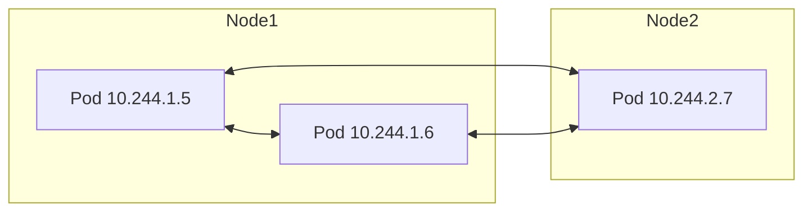
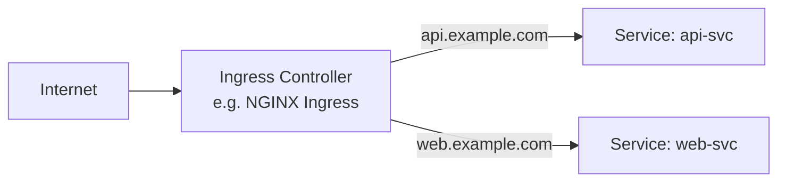

# Basic Networking

> [!summary] TL;DR
> Kubernetes networking gives every Pod its own IP, lets any Pod talk to any other Pod without NAT, and exposes workloads via [[Services]].

## The 4 Kubernetes Networking Rules

1. Every Pod gets a unique IP.
2. Pods on the same node can talk directly.
3. Pods on different nodes can talk directly — **no NAT** between Pods.
4. Nodes can talk to all Pods (and vice versa) — no NAT.



## CNI (Container Network Interface)

The cluster runs a **CNI plugin** to wire Pod networking together. Common choices:

| CNI            | Notes                                            |
| -------------- | ------------------------------------------------ |
| **Calico**     | Popular, supports network policies.              |
| **Cilium**     | eBPF-based, high performance, observability.     |
| **Flannel**    | Simple, default in many setups.                  |
| **Weave Net**  | Easy to use.                                     |

## Service Discovery

Two mechanisms:

1. **DNS** (CoreDNS) — `hello-svc.default.svc.cluster.local`. Most apps use this.
2. **Environment variables** — older mechanism. `HELLO_SVC_SERVICE_HOST`, `HELLO_SVC_SERVICE_PORT`. Avoid for new apps.

## Ingress (Brief Intro)

[[Services]] of type `LoadBalancer` give you one cloud LB per Service. **Ingress** is a smarter HTTP-level router — one IP, many hostnames/paths, TLS termination.



> [!note] Ingress is an advanced topic
> Beginners can use `NodePort` or `LoadBalancer` Services and revisit Ingress later.

## Network Policies (Brief)

By default, all Pods can talk to all Pods. **NetworkPolicies** restrict traffic (like firewall rules). Require a CNI that supports them (Calico, Cilium).

```yaml
apiVersion: networking.k8s.io/v1
kind: NetworkPolicy
metadata: { name: api-allow-web }
spec:
  podSelector: { matchLabels: { app: api } }
  ingress:
    - from:
        - podSelector: { matchLabels: { app: web } }
```

## Related Notes
- [[Services]] · [[Pods]] · [[Core Architecture]] · [[Common Terminology]]
