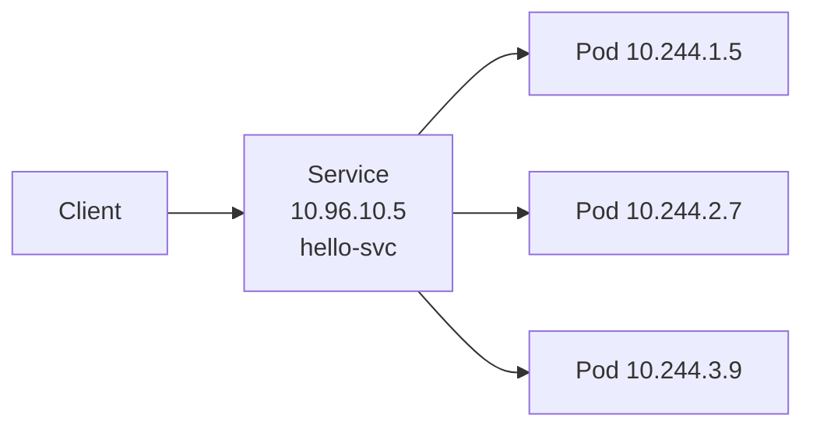
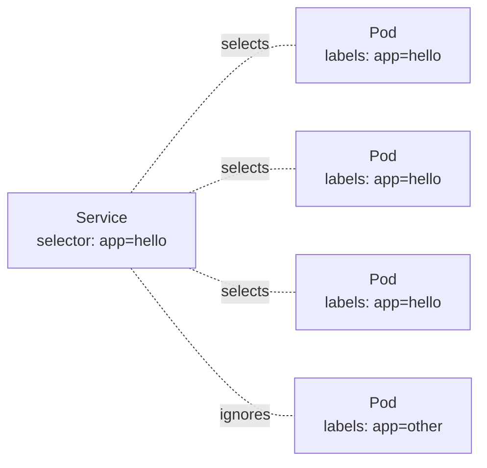

# Services

> [!summary] TL;DR
> A **Service** gives a stable network identity (IP + DNS name) to a dynamic set of [[Pods]]. Without Services, Pods would be unreachable because their IPs change constantly.

## Why Services Exist

Pods are ephemeral — they're created, destroyed, and rescheduled. Their IPs change every time. A Service provides a **stable front door** that load-balances across the current set of matching Pods.



## Service Types

| Type            | What it does                                                                       |
| --------------- | ---------------------------------------------------------------------------------- |
| `ClusterIP`     | Default. Stable IP reachable only **inside** the cluster.                          |
| `NodePort`      | Exposes the Service on a port (30000–32767) on **every** Node's IP.                |
| `LoadBalancer`  | Provisions a cloud load balancer (ELB, etc.) routing to the Service.               |
| `ExternalName`  | Returns a CNAME to an external DNS name (no proxying).                             |
| `Headless`      | `clusterIP: None`. Returns Pod IPs directly (used by StatefulSets).                |

## Minimal Service (ClusterIP)

```yaml
apiVersion: v1
kind: Service
metadata:
  name: hello-svc
spec:
  type: ClusterIP
  selector:
    app: hello
  ports:
    - port: 80          # Service port
      targetPort: 80    # Container port
```

## NodePort Example

```yaml
apiVersion: v1
kind: Service
metadata:
  name: hello-nodeport
spec:
  type: NodePort
  selector: { app: hello }
  ports:
    - port: 80
      targetPort: 80
      nodePort: 31000
```

Access: `http://<any-node-ip>:31000`.

## Service → Pod Matching



> [!important] The Service uses **labels** on Pods, not IPs.
> Make sure your Pod template's `labels` match the Service's `selector`.

## DNS

Kubernetes ships with **CoreDNS**. Each Service gets a DNS record:

```text
<service-name>.<namespace>.svc.cluster.local
```

So a Pod in the same namespace can simply call:

```bash
curl http://hello-svc
curl http://hello-svc.default.svc.cluster.local
```

## Useful Commands

```bash
kubectl get svc
kubectl get svc -o wide
kubectl describe svc hello-svc
# Run a temporary debug pod to test connectivity:
kubectl run tmp --rm -it --image=busybox -- curl http://hello-svc
```

## Related Notes
- [[Basic Networking]] · [[Pods]] · [[Deployments]] · [[Common Terminology]]
