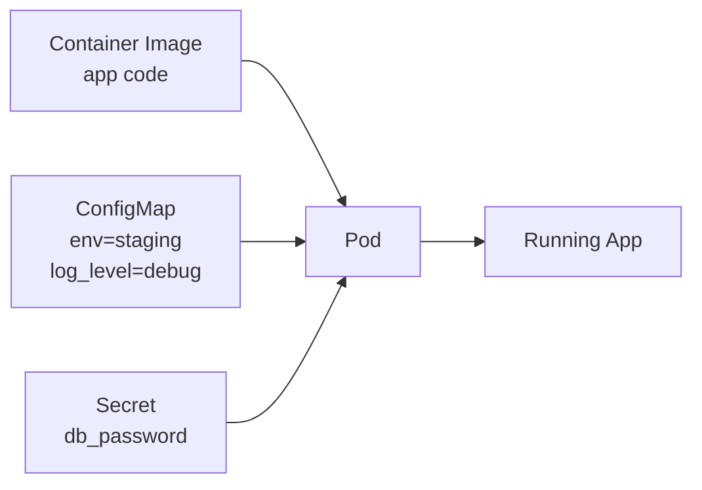

# ConfigMaps and Secrets

> [!summary] TL;DR
> **ConfigMaps** hold non-sensitive configuration; **Secrets** hold sensitive data (tokens, passwords, certs). Both let you change config without rebuilding the image.

## Why They Exist

Containers should be portable across environments. Hard-coding config in the image breaks that. Instead:

- Bake the **app logic** into the image.
- Inject **environment-specific config** via ConfigMaps & Secrets at runtime.



## ConfigMap Example

```yaml
apiVersion: v1
kind: ConfigMap
metadata:
  name: app-config
data:
  LOG_LEVEL: "debug"
  FEATURE_FLAGS: "new-ui,beta"
  config.yaml: |
    server:
      port: 8080
      timeout: 30s
```

## Using a ConfigMap in a Pod

**As environment variables:**

```yaml
spec:
  containers:
    - name: app
      image: myapp:1.0
      envFrom:
        - configMapRef: { name: app-config }
```

**As a file (mounted):**

```yaml
spec:
  containers:
    - name: app
      image: myapp:1.0
      volumeMounts:
        - name: cfg
          mountPath: /etc/app
  volumes:
    - name: cfg
      configMap: { name: app-config }
```

## Secret Example

```yaml
apiVersion: v1
kind: Secret
metadata:
  name: db-creds
type: Opaque
stringData:
  username: "admin"
  password: "s3cr3t-p@ss"
```

> [!warning] Secrets are NOT encrypted by default
> They're only base64-encoded in `etcd`. Enable **encryption at rest** for real protection, and restrict access with RBAC. Consider external secret stores (Vault, AWS Secrets Manager, Sealed Secrets) for production.

## Using a Secret in a Pod

```yaml
spec:
  containers:
    - name: app
      image: myapp:1.0
      env:
        - name: DB_PASSWORD
          valueFrom:
            secretKeyRef: { name: db-creds, key: password }
```

## ConfigMap vs Secret

| Property            | ConfigMap            | Secret                          |
| ------------------- | -------------------- | ------------------------------- |
| Purpose             | Non-sensitive config | Sensitive data                  |
| Storage in `etcd`   | Plain text           | Base64 (enable encryption!)     |
| Size limit          | 1 MiB                | 1 MiB                           |
| Typical usage       | env, config files    | passwords, tokens, TLS certs    |

## Useful Commands

```bash
kubectl get cm
kubectl get secret
kubectl describe cm app-config
kubectl create configmap app-config --from-literal=LOG_LEVEL=debug
kubectl create secret generic db-creds   --from-literal=username=admin --from-literal=password=s3cr3t
```

## Related Notes
- [[Pods]] · [[Volumes]] · [[Namespaces]] · [[Best Practices for Beginners]]
