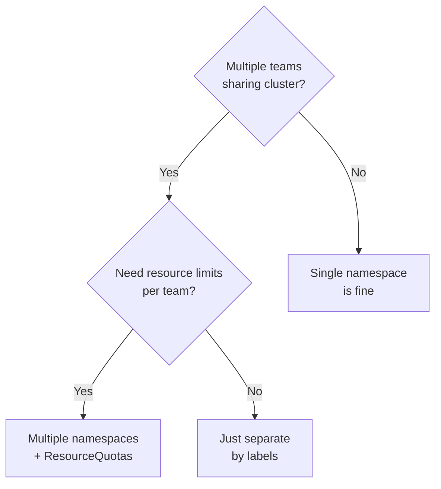

# Namespaces

> [!summary] TL;DR
> A **Namespace** is a logical partition inside a cluster — useful for separating teams, environments, or resources.

## Why Use Namespaces?

- **Logical isolation** — `dev`, `staging`, `prod` in one cluster.
- **RBAC scope** — restrict users to specific namespaces.
- **Resource quotas** — limit CPU/memory per team.
- **DNS scoping** — `<svc>.<namespace>.svc.cluster.local`.

> [!note] Not everything should be namespaced
> Nodes, PersistentVolumes, StorageClasses are **cluster-scoped** (not in any namespace).

## Default Namespaces

| Namespace        | Purpose                                                            |
| ---------------- | ----------------------------------------------------------------- |
| `default`        | Where your stuff lands if you don't pick one.                      |
| `kube-system`    | Control plane & add-ons (CoreDNS, kube-proxy, CNI).               |
| `kube-public`    | Readable by all; usually contains cluster info.                    |
| `kube-node-lease`| Heartbeat leases for nodes.                                       |

## Working with Namespaces

```bash
# List
kubectl get namespaces

# Create
kubectl create namespace dev

# Use -n to target a namespace
kubectl get pods -n dev
kubectl apply -f deploy.yaml -n dev

# Set your default namespace (current context)
kubectl config set-context --current --namespace=dev

# Verify
kubectl config view --minify | grep namespace
```

## Manifest Example

```yaml
apiVersion: v1
kind: Namespace
metadata:
  name: team-payments
  labels:
    env: prod
    team: payments
```

## ResourceQuota (Beginner Overview)

```yaml
apiVersion: v1
kind: ResourceQuota
metadata:
  name: team-payments-quota
  namespace: team-payments
spec:
  hard:
    requests.cpu: "10"
    requests.memory: 20Gi
    limits.cpu: "20"
    limits.memory: 40Gi
    pods: "50"
```

## Namespace Decision Guide



## Related Notes
- [[Clusters]] · [[ConfigMaps and Secrets]] · [[Kubectl Commands]]
