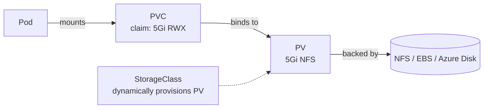

# Volumes

> [!summary] TL;DR
> Containers' filesystems are ephemeral — data is lost when the container dies. **Volumes** let Pods persist and share data; **PersistentVolumes** let data outlive a Pod's lifetime.

## Why Volumes?

By default, anything written inside a container is lost when it restarts. Volumes solve:

1. **Sharing data** between containers in the same Pod.
2. **Persisting data** across container restarts.
3. **Persisting data** across Pod restarts (PV/PVC).

## Volume Types (Built-in Pod-Level)

| Type            | Description                                                 |
| --------------- | ---------------------------------------------------------- |
| `emptyDir`      | Scratch space, lives with the Pod. Lost when Pod dies.     |
| `hostPath`      | Mounts a file/dir from the node. **Security risk.**        |
| `configMap`     | Mounts a [[ConfigMaps and Secrets\|ConfigMap]] as files.   |
| `secret`        | Mounts a Secret as files.                                  |
| `persistentVolumeClaim` | Mounts a PV (durable storage).                      |

## emptyDir Example

```yaml
apiVersion: v1
kind: Pod
metadata: { name: shared-pod }
spec:
  containers:
    - name: writer
      image: busybox
      command: ["sh", "-c", "while true; do echo $(date) >> /data/log.txt; sleep 5; done"]
      volumeMounts: [ { name: data, mountPath: /data } ]
    - name: reader
      image: busybox
      command: ["sh", "-c", "tail -f /data/log.txt"]
      volumeMounts: [ { name: data, mountPath: /data } ]
  volumes:
    - name: data
      emptyDir: {}
```

## Persistent Volumes (PV) & Claims (PVC) — The Bigger Picture



- **PersistentVolume (PV)** — a piece of storage in the cluster (admin-managed or dynamically provisioned).
- **PersistentVolumeClaim (PVC)** — a user's request for storage (size, access mode).
- **StorageClass** — defines how PVs are dynamically provisioned (e.g. `gp2`, `standard`).

## PVC Example

```yaml
apiVersion: v1
kind: PersistentVolumeClaim
metadata: { name: data-pvc }
spec:
  accessModes: [ "ReadWriteOnce" ]
  resources:
    requests: { storage: 5Gi }
  storageClassName: standard
```

## Using a PVC in a Pod

```yaml
spec:
  containers:
    - name: app
      image: postgres:16
      volumeMounts: [ { name: pgdata, mountPath: /var/lib/postgresql/data } ]
  volumes:
    - name: pgdata
      persistentVolumeClaim: { claimName: data-pvc }
```

## Access Modes

| Mode              | Meaning                                                            |
| ----------------- | ------------------------------------------------------------------ |
| `ReadWriteOnce`   | Mounted read-write by one node.                                    |
| `ReadOnlyMany`    | Mounted read-only by many nodes.                                   |
| `ReadWriteMany`   | Mounted read-write by many nodes (requires NFS-like backend).      |
| `ReadWriteOncePod`| Only one Pod can mount it RW.                                      |

> [!tip] Database on K8s?
> Use `ReadWriteOnce` with a fast block disk (e.g. EBS gp3). For multi-writer needs (like shared media uploads), pick a storage backend that supports `ReadWriteMany` (NFS, EFS, CephFS).

## Related Notes
- [[Pods]] · [[ConfigMaps and Secrets]] · [[Best Practices for Beginners]]
