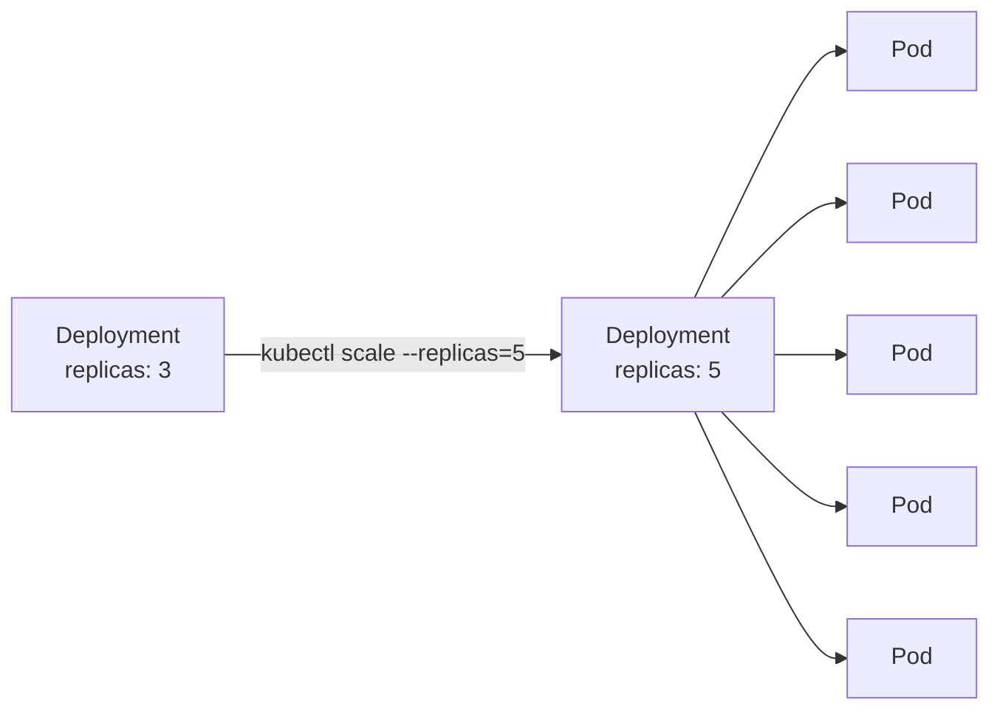
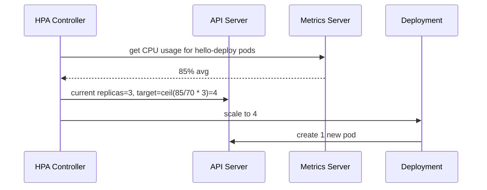

# Basic Scaling

> [!summary] TL;DR
> Kubernetes scales apps **horizontally** by changing the number of Pod replicas. The **Horizontal Pod Autoscaler (HPA)** can do this automatically based on CPU/memory or custom metrics.

## Manual Scaling

```bash
# Scale a Deployment to 5 replicas
kubectl scale deploy/hello-deploy --replicas=5

# Confirm
kubectl get deploy hello-deploy
```



## Horizontal Pod Autoscaler (HPA)

```yaml
apiVersion: autoscaling/v2
kind: HorizontalPodAutoscaler
metadata: { name: hello-hpa }
spec:
  scaleTargetRef:
    apiVersion: apps/v1
    kind: Deployment
    name: hello-deploy
  minReplicas: 3
  maxReplicas: 20
  metrics:
    - type: Resource
      resource: { name: cpu, target: { type: Utilization, averageUtilization: 70 } }
```

## HPA in Action



> [!note] Metrics Server is required
> HPA needs the **metrics-server** add-on. Most managed clusters (EKS/GKE/AKS) include it. For local clusters, install it manually.

## Useful Commands

```bash
kubectl get hpa
kubectl describe hpa hello-hpa
kubectl autoscale deploy hello-deploy --min=3 --max=10 --cpu-percent=70
```

## Scaling Concepts Cheat Sheet

| Mechanism            | Scales what?                          | Trigger                         |
| -------------------- | ------------------------------------- | ------------------------------- |
| `kubectl scale`      | Number of replicas                    | Manual                          |
| HPA                  | Number of replicas                    | CPU / memory / custom metrics   |
| VPA                  | CPU/memory requests of Pods           | Historical usage                |
| Cluster Autoscaler   | Number of [[Nodes\|nodes]]            | Pending Pods due to capacity    |
| Karpenter            | Number of nodes (smarter, faster)     | Pending Pods                    |

## Beginner Recommendations

-  Set `resources.requests` so HPA can compute utilization.
-  Start with HPA on CPU, then move to custom metrics later.
-  Pair HPA with Cluster Autoscaler for end-to-end scaling.

## Related Notes
- [[Deployments]] · [[ReplicaSets]] · [[Nodes]] · [[Kubectl Commands]]
