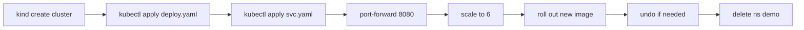

# Deploy a Simple Application

> [!summary] TL;DR
> A practical walkthrough: deploy an NGINX web server, expose it, scale it, and roll out a new version.

## Prerequisites

- `kubectl` installed → see [[Kubectl Commands]].
- A local cluster running (kind, minikube, or Docker Desktop).

```bash
# Quick start with kind
kind create cluster --name learn
kubectl cluster-info
kubectl get nodes
```

## Step 1 — Create a Namespace

```bash
kubectl create ns demo
kubectl config set-context --current --namespace=demo
```

## Step 2 — Deploy

`deploy.yaml`:

```yaml
apiVersion: apps/v1
kind: Deployment
metadata:
  name: web
spec:
  replicas: 3
  selector: { matchLabels: { app: web } }
  template:
    metadata: { labels: { app: web } }
    spec:
      containers:
        - name: nginx
          image: nginx:1.27-alpine
          ports: [ { containerPort: 80 } ]
          readinessProbe:
            httpGet: { path: /, port: 80 }
          resources:
            requests: { cpu: 50m, memory: 64Mi }
            limits:   { cpu: 200m, memory: 128Mi }
```

```bash
kubectl apply -f deploy.yaml
kubectl get pods -w
```

## Step 3 — Expose with a Service

`svc.yaml`:

```yaml
apiVersion: v1
kind: Service
metadata: { name: web-svc }
spec:
  type: NodePort
  selector: { app: web }
  ports: [ { port: 80, targetPort: 80, nodePort: 31000 } ]
```

```bash
kubectl apply -f svc.yaml
kubectl get svc web-svc
```

## Step 4 — Reach It

```bash
# Forward local 8080 -> Service 80
kubectl port-forward svc/web-svc 8080:80
# open http://localhost:8080
```

## Step 5 — Scale

```bash
kubectl scale deploy/web --replicas=6
kubectl get pods -l app=web
```

## Step 6 — Roll Out a New Version

```bash
kubectl set image deploy/web nginx=nginx:1.28-alpine
kubectl rollout status deploy/web
kubectl rollout history deploy/web
```

If something breaks:

```bash
kubectl rollout undo deploy/web
```

## Step 7 — Clean Up

```bash
kubectl delete ns demo
```

## Full Flow



## Related Notes
- [[Kubectl Commands]] · [[Deployments]] · [[Services]] · [[Pods]] · [[Best Practices for Beginners]]
