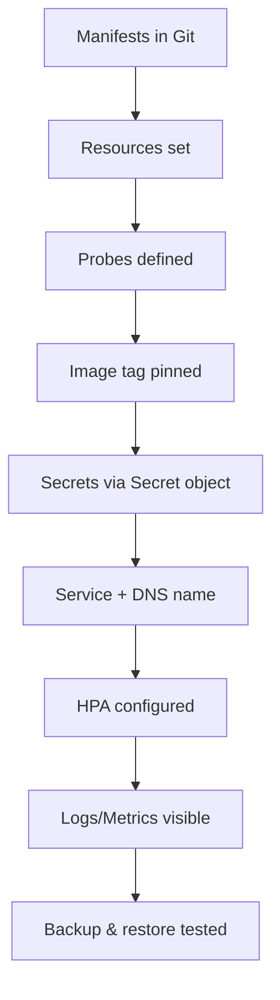

# Best Practices for Beginners

> [!summary] TL;DR
> Practical, opinionated rules to start Kubernetes on the right foot. Each one saves you pain later.

## 1. Use Declarative Manifests, Not Imperative Commands

 `kubectl run nginx --image=nginx`
 `kubectl apply -f deployment.yaml`

Keep manifests in Git. You get history, reviews, and reproducibility.

## 2. Always Set Resource Requests & Limits

```yaml
resources:
  requests: { cpu: 100m, memory: 128Mi }
  limits:   { cpu: 500m, memory: 256Mi }
```

Without requests, the scheduler can't place Pods properly and HPA can't calculate utilization.

## 3. Pin Image Tags — Never Use `:latest`

 `image: nginx:latest`
 `image: nginx:1.27-alpine`

`:latest` makes rollouts non-deterministic and debugging painful.

## 4. Always Use a Deployment (or Job/StatefulSet), Never a Bare Pod

A bare Pod has no self-healing. See [[Deployments]].

## 5. Define Readiness & Liveness Probes

```yaml
readinessProbe:
  httpGet: { path: /ready, port: 8080 }
livenessProbe:
  httpGet: { path: /healthz, port: 8080 }
```

Without readiness probes, rolling updates route traffic to broken Pods.

## 6. Use Namespaces for Isolation

Even on a small team, separate `dev` / `staging` / `prod`. See [[Namespaces]].

## 7. Don't Put Secrets in Images or ConfigMaps

Use [[ConfigMaps and Secrets|Secrets]] (or better: external secret stores like Vault / Sealed Secrets / External Secrets Operator).

## 8. Keep the Control Plane Healthy

- Back up `etcd` regularly.
- Upgrade clusters one minor version at a time.
- Use a managed control plane (EKS/GKE/AKS) if you don't have a dedicated platform team.

## 9. Lint Your Manifests

Use `kube-score`, `kubeval`, or `kubesec` in CI to catch issues early.

## 10. Learn `kubectl explain` and `-o yaml`

```bash
kubectl explain deploy.spec.strategy
kubectl get pod mypod -o yaml
```

This is the fastest way to learn the API.

## 11. Use Labels Consistently

Recommended labels:
- `app`
- `version`
- `tier`
- `env`

They power selectors, dashboards, and cost tracking.

## 12. Start with One Cluster, Two at Most

Multi-cluster is complex. Start with one cluster per environment (dev/staging/prod).

## 13. Treat the Cluster as Cattle, Not Pets

- Automate provisioning (Terraform / Cluster API).
- Don't SSH into nodes for routine work.
- Make changes via GitOps (ArgoCD / Flux).

## 14. Observability From Day One

- **Metrics**: Prometheus + Grafana.
- **Logs**: Loki or ELK.
- **Tracing**: OpenTelemetry + Jaeger/Tempo.

## 15. Read the Official Docs

- <https://kubernetes.io/docs/home/>
- <https://kubernetes.io/docs/reference/kubectl/conventions/>

## Checklist for Your First Production Deployment



## Related Notes
- [[Kubectl Commands]] · [[Deploy a Simple Application]] · [[Common Terminology]] · [[Shared/readme]]
