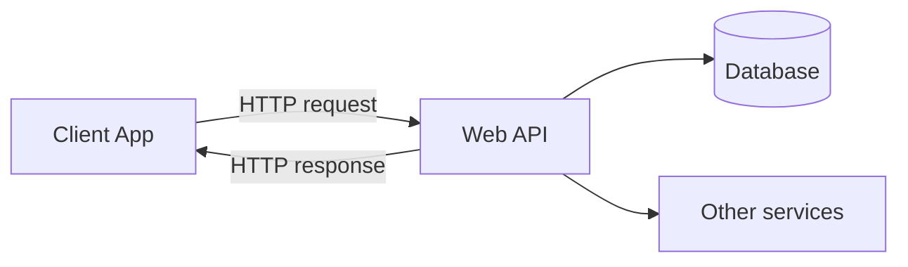

# APIs and HTTP

> [!summary] TL;DR
> An **API** is a contract for software to talk to software. **HTTP** is the protocol most web APIs use. Understanding HTTP is a prerequisite for using Postman well.

## What Is an API?

An **Application Programming Interface** is a set of rules that lets one program ask another program to do something. In web terms, an API typically:

- Lives at a URL (e.g. `https://api.example.com/v1/users`).
- Accepts HTTP requests.
- Returns structured data (usually JSON).



## HTTP Basics

HTTP is a request/response protocol. Each request has:

- A **method** (GET, POST, …) — see [[HTTP Methods]].
- A **URL** (scheme, host, path, query string).
- **Headers** (metadata).
- An optional **body** (for POST/PUT/PATCH).
- An **auth** mechanism.

Each response has:

- A **status code**.
- **Headers**.
- An optional **body**.

## Anatomy of a URL

```text
https://api.example.com:443/v1/users?active=true&limit=10#section
└─┬─┘   └────┬─────┘ └┬┘ └─┬──┘ └─────────┬───────────────┘
scheme      host    port  path          query string
```

| Part         | Description                                            |
| ------------ | ----------------------------------------------------- |
| `scheme`     | `http` or `https`.                                    |
| `host`       | Domain or IP.                                         |
| `port`       | Optional; defaults to 80 (HTTP) / 443 (HTTPS).        |
| `path`       | Resource path.                                        |
| `query`      | `?key=value&key2=value2` — extra params.              |
| `fragment`   | `#...` — client-side anchor (not sent to server).     |

## HTTP Status Codes

| Range  | Category   | Examples                                         |
| ------ | ---------- | ----------------------------------------------- |
| 1xx    | Informational | `100 Continue`                                |
| 2xx    | Success    | `200 OK`, `201 Created`, `204 No Content`         |
| 3xx    | Redirection | `301 Moved`, `304 Not Modified`                  |
| 4xx    | Client error | `400 Bad Request`, `401 Unauthorized`, `404 Not Found`, `422 Unprocessable` |
| 5xx    | Server error | `500 Internal`, `502 Bad Gateway`, `503 Service Unavailable` |

## A Sample Exchange

```http
POST /v1/users HTTP/1.1
Host: api.example.com
Content-Type: application/json
Authorization: Bearer eyJhbGc...

{ "name": "Ada", "email": "ada@example.com" }
```

```http
HTTP/1.1 201 Created
Location: /v1/users/42
Content-Type: application/json

{ "id": 42, "name": "Ada", "email": "ada@example.com" }
```

## Common API Styles

| Style       | Description                                                |
| ----------- | --------------------------------------------------------- |
| **REST**    | Resource-based, HTTP methods, status codes. Most common.   |
| **GraphQL** | Single endpoint, query language for fetching exactly what you need. |
| **gRPC**    | Binary protocol over HTTP/2, strongly-typed via Protobuf.  |
| **WebSocket** | Full-duplex, persistent connection.                     |
| **SOAP**    | XML-based, stricter contract (rarely used in new APIs).    |

See [[REST GraphQL WebSocket gRPC]].

## JSON — The Lingua Franca

Most modern APIs use JSON. Quick refresher:

```json
{
  "id": 42,
  "name": "Ada",
  "active": true,
  "tags": ["admin", "early-adopter"],
  "address": { "city": "London", "zip": "NW1" },
  "balance": null
}
```

| JSON type   | Example            |
| ----------- | ------------------ |
| string      | `"hello"`          |
| number      | `42`, `3.14`       |
| boolean     | `true` / `false`   |
| null        | `null`             |
| array       | `[1, 2, 3]`        |
| object      | `{ "k": "v" }`     |

## Related Notes
- [[HTTP Methods]] · [[Headers Params and Body]] · [[Authentication]] · [[Creating and Sending Requests]]
