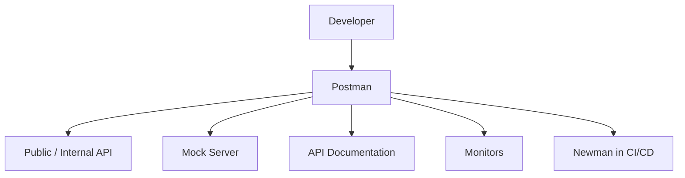
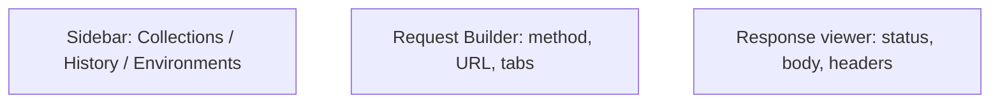

# Introduction to Postman

> [!summary] TL;DR
> **Postman** is a collaboration platform for API development — design, test, document, mock, monitor, and share APIs, all in one tool.

## What Is Postman?

Postman started in 2012 as a tiny Chrome extension for sending HTTP requests. It has grown into a complete **API platform** used by millions of developers. You can use it to:

- Send any HTTP request (REST, GraphQL, WebSocket, gRPC).
- Save and organize requests into **collections**.
- Automate tests with JavaScript.
- Mock servers and document APIs.
- Monitor APIs in production.
- Collaborate with teammates via **workspaces**.
- Run collections from CI/CD with **Newman**.

## The Postman Ecosystem

| Layer            | Tool / Feature                                  |
| ---------------- | ----------------------------------------------- |
| **Design**       | API Builder, OpenAPI editor                     |
| **Develop**      | Request builder, environments, scripts          |
| **Test**         | Test scripts, Collection Runner, Newman         |
| **Document**     | Auto-generated docs, public/private sharing     |
| **Mock**         | Mock servers for parallel frontend/backend dev  |
| **Monitor**      | Scheduled collections run from the cloud        |
| **Collaborate**  | Workspaces, comments, roles, version control    |
| **Deploy**       | API network, integrations with CI/CD            |

## Free vs Paid

| Feature                            | Free       | Paid       |
| ---------------------------------- | ---------- | ---------- |
| Requests / collections             |           |           |
| Environments / globals             |           |           |
| Pre-request & test scripts         |           |           |
| Mock servers                       | Limited    | More       |
| Monitors                           | Limited    | More       |
| Team workspaces                    | Limited    |           |
| SSO, audit logs                    |           |           |

> [!note] Free is enough to learn
> The free tier covers everything you need to follow this vault end-to-end.

## Postman UI At a Glance

See [[Installing and Setting Up]] to get going.

## Related Notes
- [[Installing and Setting Up]] · [[APIs and HTTP]] · [[Creating and Sending Requests]] · [[Best Practices and Troubleshooting]]
