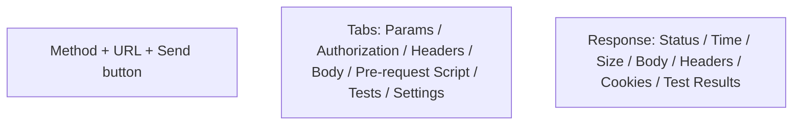

# Creating and Sending Requests

> [!summary] TL;DR
> The **Request Builder** is where you compose and send a single HTTP request. Pick a method, type a URL, set headers/body, hit **Send**.

## The Builder Layout



## Sending Your First Request

1. Open a new tab (**+**).
2. Method = **GET**.
3. URL = `https://httpbin.org/get?greeting=hello`.
4. (Optional) Go to **Params** tab — the query string is parsed there.
5. Click **Send**.
6. The **Response** pane shows status, time, size, body, and response headers.

## Saving Requests

- **Save** (Ctrl/Cmd+S) → choose a [[Collections and Folders|collection]] + folder.
- Saved requests remember URL, method, headers, body, scripts, tests, and variables.

## Tabs Inside a Request

| Tab                | Purpose                                                    |
| ------------------ | ---------------------------------------------------------- |
| **Params**         | Query string parameters (key/value table).                 |
| **Authorization**  | Auth method (see [[Authentication]]).                      |
| **Headers**        | Request headers.                                           |
| **Body**           | Request body for POST/PUT/PATCH.                           |
| **Pre-request Script** | JS that runs before sending (see [[Pre-request Scripts]]). |
| **Tests**          | JS assertions that run after response (see [[Test Scripts]]). |
| **Settings**       | Per-request options (follow redirects, SSL verification).  |

## Body Types

| Type                     | Use case                                          |
| ------------------------ | ------------------------------------------------- |
| **none**                 | GET / DELETE — no body.                           |
| **form-data**            | Multipart upload (files + fields).                |
| **x-www-form-urlencoded**| HTML form-style body.                             |
| **raw** (JSON / text / xml / html / javascript) | Raw payload. Most APIs use JSON here. |
| **binary**               | Send a raw file (e.g. an image).                  |
| **GraphQL**              | GraphQL query body (auto-sets `Content-Type`).    |

## Example: POST JSON

1. Method = **POST**.
2. URL = `https://httpbin.org/post`.
3. **Body** → `raw` → `JSON`.
4. Paste:

```json
{
  "name": "Ada",
  "role": "admin"
}
```

5. Send → look at the response's `json` field — it echoes your body.

## Example: Upload a File

1. Method = **POST**.
2. URL = `https://httpbin.org/post`.
3. **Body** → `form-data`.
4. Add a row: key = `file`, type = **File**, pick a file.
5. Send → response shows the uploaded file name and content type.

## Keyboard Shortcuts (Most Useful)

| Shortcut             | Action                       |
| -------------------- | ---------------------------- |
| `Ctrl/Cmd + N`       | New request tab.             |
| `Ctrl/Cmd + S`       | Save request.                |
| `Ctrl/Cmd + Enter`   | Send request.                |
| `Alt + ↓/↑`          | Switch response tabs.        |
| `Ctrl/Cmd + K`       | Quick search.                |

## Tips

- Use the **History** panel (left sidebar) to re-open any past request.
- Hover any URL → use **`{{variable}}`** for env var substitution (see [[Environment and Global Variables]]).
- Click the URL bar's **code** icon (right side, `</>`) to generate cURL, Python `requests`, JavaScript `fetch`, and more.

## Related Notes
- [[HTTP Methods]] · [[Headers Params and Body]] · [[Authentication]] · [[Environment and Global Variables]]
