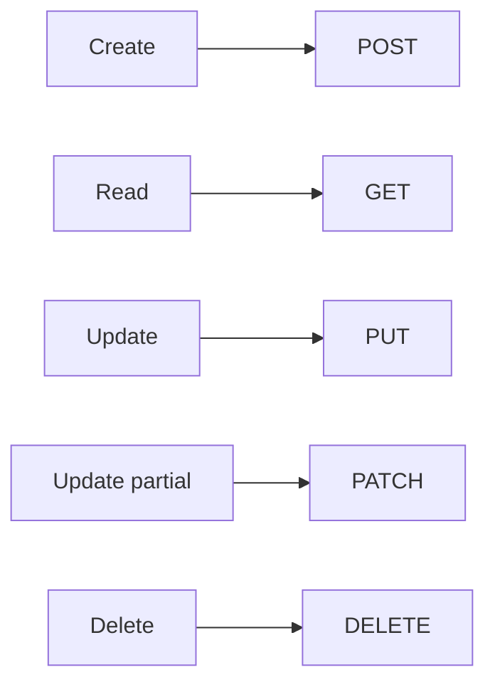

# HTTP Methods

> [!summary] TL;DR
> HTTP methods (verbs) tell the server **what to do** with the resource identified by the URL. The 5 most common are GET, POST, PUT, PATCH, DELETE.

## The Big Five

| Method  | Intent                          | Safe? | Idempotent? | Typical body? |
| ------- | ------------------------------- | ----- | ----------- | ------------- |
| GET     | Read a resource.                |     |           |             |
| POST    | Create a new resource.          |     |           |             |
| PUT     | Replace a resource entirely.    |     |           |             |
| PATCH   | Partially update a resource.    |     |  (often)  |             |
| DELETE  | Remove a resource.              |     |           | Optional      |

> [!note] Safe vs Idempotent
> **Safe** = no server state change. **Idempotent** = doing it N times has the same effect as doing it once.

## Less Common Methods

| Method   | Use                                                 |
| -------- | --------------------------------------------------- |
| HEAD     | Like GET but no body (just headers).                |
| OPTIONS  | Ask server which methods are allowed (CORS preflight).|
| TRACE    | Echo back the request for debugging.                |
| CONNECT  | Establish a tunnel (HTTPS proxy).                   |

## Examples with httpbin.org

### GET — read

```http
GET https://httpbin.org/get?name=ada
```

Response: 200 OK with a JSON body echoing headers and args.

### POST — create

```http
POST https://httpbin.org/post
Content-Type: application/json

{ "name": "ada" }
```

Response: 200 OK with the body echoed in `json`.

### PUT — replace

```http
PUT https://httpbin.org/put
Content-Type: application/json

{ "id": 1, "name": "ada-put" }
```

### PATCH — partial update

```http
PATCH https://httpbin.org/patch
Content-Type: application/json

{ "name": "ada-patched" }
```

### DELETE — remove

```http
DELETE https://httpbin.org/delete
```

## CRUD  HTTP Methods Mapping



## Choosing POST vs PUT

- **POST** to a collection → server assigns the ID.
  - `POST /users` → creates user, returns `201 Created` with `Location: /users/42`.
- **PUT** to a specific URL → client supplies the ID.
  - `PUT /users/42` → creates or replaces user 42.

## Choosing PUT vs PATCH

- **PUT** replaces the whole resource. Send the full object.
- **PATCH** sends only the fields that change.

```json
// Original
{ "id": 1, "name": "Ada", "email": "ada@x.com", "active": true }

// PATCH /users/1
{ "active": false }

// PUT /users/1
{ "id": 1, "name": "Ada", "email": "ada@x.com", "active": false }
```

## Postman Tips for Methods

- Pick the method from the dropdown before typing the URL — `Ctrl/Cmd + Alt + ↓/↑` cycles methods.
- For methods without a body (GET/DELETE), the **Body** tab shows **none** by default.
- For OPTIONS, you can use Postman's **Headers** tab to inspect `Allow` in the response.

## Related Notes
- [[Creating and Sending Requests]] · [[Headers Params and Body]] · [[APIs and HTTP]]
