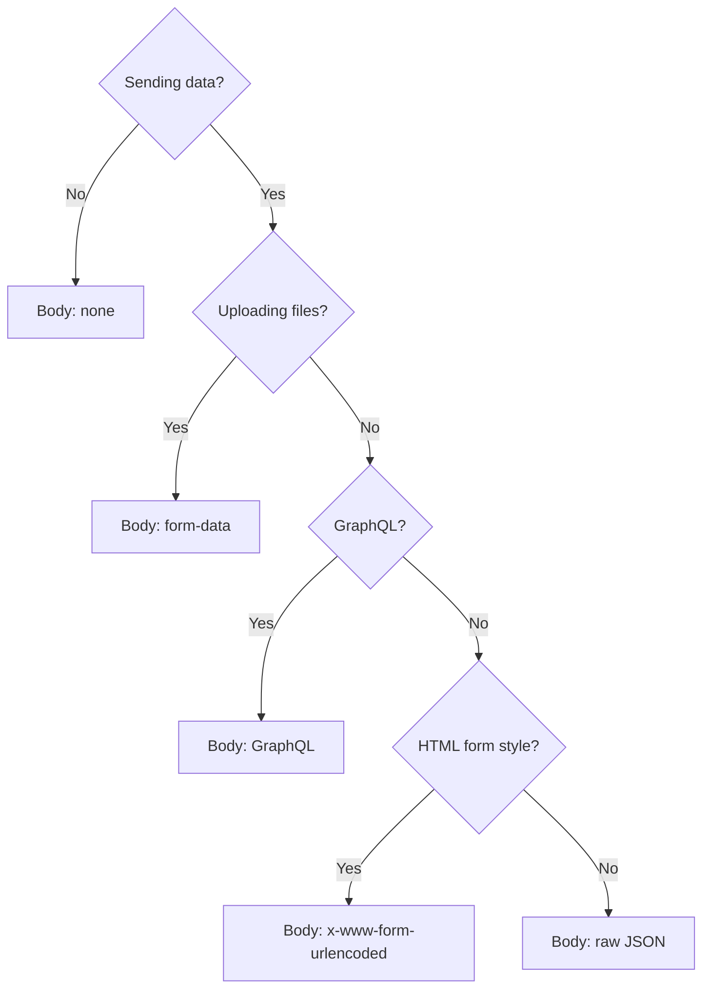

# Headers, Query Parameters, Path Parameters, and Request Bodies

> [!summary] TL;DR
> Four things you set on almost every request: **headers** (metadata), **query params** (filtering/search), **path params** (resource ID), and **body** (payload).

## 1. Headers

Headers are key/value metadata sent with the request or response. Common request headers:

| Header             | Example                              | Purpose                                  |
| ------------------ | ------------------------------------ | ---------------------------------------- |
| `Content-Type`     | `application/json`                   | Format of the request body.              |
| `Accept`           | `application/json`                   | Format the client wants back.            |
| `Authorization`    | `Bearer <token>`                     | Auth (see [[Authentication]]).           |
| `User-Agent`       | `PostmanRuntime/7.36`                | Identifies the client.                   |
| `Cache-Control`    | `no-cache`                           | Caching directives.                      |
| `Cookie`           | `session=abc123`                     | Sent cookies (Postman manages these).    |

In Postman: **Headers** tab → add rows. Toggle the checkbox to enable/disable.

> [!tip] Hidden headers
> Postman auto-adds some headers (`User-Agent`, `Accept`, `Host`). Click **hidden** to see them.

## 2. Query Parameters

The part after `?` in the URL: `?key=value&key2=value2`.

In Postman: **Params** tab. The URL bar updates as you edit and vice versa.

```text
GET https://httpbin.org/get?active=true&limit=10&sort=desc
```

| Key     | Value   |
| ------- | ------- |
| active  | true    |
| limit   | 10      |
| sort    | desc    |

Tips:
- Disable a param without deleting it (uncheck).
- Use `{{variable}}` in either key or value.

## 3. Path Parameters

Path params are *part of the URL path*, not the query string. Example:

```text
GET /users/:userId/posts/:postId
```

In Postman, when you type `:userId` in the URL, a **Path Variables** section appears under the **Params** tab.

| Variable | Value |
| -------- | ----- |
| userId   | 42    |
| postId   | 7     |

The actual request becomes `GET /users/42/posts/7`.

> [!note] REST convention
> `:id` style is a Postman convention. The server just sees the resolved URL.

## 4. Request Body

Used with POST, PUT, PATCH (and sometimes DELETE). Choose a body type under the **Body** tab:

| Type                  | Use                                                  |
| --------------------- | ---------------------------------------------------- |
| `none`                | No body.                                             |
| `form-data`           | Multipart: files + text fields.                      |
| `x-www-form-urlencoded` | HTML form-style: `key=value&key2=value2`.          |
| `raw`                 | JSON / XML / text / HTML / JavaScript.               |
| `binary`              | Raw bytes from a file.                               |
| `GraphQL`             | GraphQL query + variables.                           |

### JSON body example

```json
{
  "title": "Hello",
  "body": "World",
  "userId": 1
}
```

- Postman auto-sets `Content-Type: application/json` when you pick `raw → JSON`.
- Use `Beautify` to format, `Compact` to minify.

### form-data example (file upload)

| Key     | Type | Value            |
| ------- | ---- | ---------------- |
| title   | Text | My photo         |
| file    | File | (pick image.png) |

## Decision Flow



## Common Mistakes

-  Setting `Content-Type: application/json` while body is `form-data` — Postman ignores it.
-  Forgetting to encode special chars in query params (use Postman's table — it encodes for you).
-  Mixing path variables across requests (each request has its own set).
-  Sending a body with GET — some servers reject it.

## Related Notes
- [[Creating and Sending Requests]] · [[HTTP Methods]] · [[Authentication]] · [[Environment and Global Variables]]
