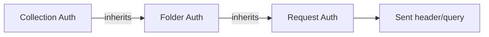
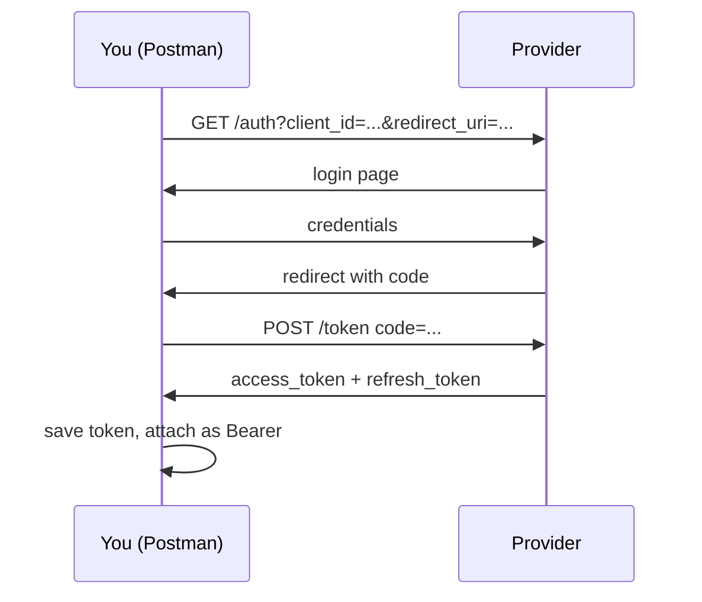

# Authentication

> [!summary] TL;DR
> Postman supports every common auth scheme — API Key, Basic, Bearer, OAuth 2.0, JWT, AWS, Hawk, NTLM, etc. — under the **Authorization** tab.

## Where to Configure

The **Authorization** tab on a request (or on a collection/folder for inheritance).



> [!tip] Auth inheritance
> Set auth once on a collection; all child requests inherit it. Override per-request when needed.

## Auth Types (Most Common)

### No Auth

Default — no credentials attached.

### API Key

Send a key/value as a header, query param, or cookie.

| Setting | Example            |
| ------- | ------------------ |
| Key     | `X-API-Key`        |
| Value   | `my-secret-key`    |
| Add to  | Header / Query / Cookie |

Resulting request:
```http
GET /v1/widgets HTTP/1.1
X-API-Key: my-secret-key
```

### Basic Auth

Sends `Authorization: Basic <base64(user:pass)>`. Postman encodes for you.

```http
Authorization: Basic YWRtaW46czNjcjN0
```

> [!warning] Basic Auth over plain HTTP is unsafe
> Always use HTTPS with Basic Auth.

### Bearer Token

Sends `Authorization: Bearer <token>`.

| Setting | Value                       |
| ------- | --------------------------- |
| Token   | `eyJhbGc...` (your JWT)     |

### JWT (Bearer with extras)

JWTs are bearer tokens with structured claims. Postman can:
- Decode a JWT visually — click the token in the headers tab → "Decode".
- Generate a JWT via pre-request script (rare; usually your server mints them).

See [[Pre-request Scripts]] for an example.

### OAuth 2.0

The most complex — but Postman walks you through it.

1. **Authorization** tab → type = **OAuth 2.0**.
2. Click **Configure New Token**.
3. Fill in:
   - **Callback URL** (e.g. `https://oauth.pstmn.io/v1/callback`).
   - **Auth URL** — provider's login page.
   - **Access Token URL** — provider's token endpoint.
   - **Client ID** + **Client Secret**.
   - **Scope** (e.g. `openid profile email`).
4. Click **Get New Access Token** → log in → token appears.
5. Click **Use Token**.



### AWS Signature

For AWS APIs (S3, API Gateway with IAM auth):
- Access Key, Secret Key, Region, Service Name.
- Postman computes the SigV4 signature per request.

### Hawk, NTLM, Digest

Less common; Postman supports them with the same form-based UI.

## Managing Tokens with Variables

Best practice — store tokens in variables, not hardcoded:

1. Set `access_token` variable in environment.
2. In Authorization → type **Bearer** → Token = `{{access_token}}`.
3. After login, auto-update via test script:

```javascript
// In Tests tab of the login request:
const json = pm.response.json();
pm.environment.set('access_token', json.access_token);
pm.environment.set('refresh_token', json.refresh_token);
```

## Refreshing Tokens Automatically

Use a pre-request script at folder/collection level to refresh when expired:

```javascript
const expiresAt = parseInt(pm.environment.get('expires_at') || '0', 10);
const now = Date.now() / 1000;

if (now > expiresAt - 60) {
  const refresh = pm.environment.get('refresh_token');
  // Send a synchronous refresh (Postman uses sendRequest)
  pm.sendRequest({
    url: pm.variables.get('token_url'),
    method: 'POST',
    header: { 'Content-Type': 'application/x-www-form-urlencoded' },
    body: {
      mode: 'urlencoded',
      urlencoded: [
        { key: 'grant_type', value: 'refresh_token' },
        { key: 'refresh_token', value: refresh },
        { key: 'client_id', value: pm.variables.get('client_id') },
        { key: 'client_secret', value: pm.variables.get('client_secret') }
      ]
    }
  }, (err, res) => {
    if (err) { console.error(err); return; }
    const j = res.json();
    pm.environment.set('access_token', j.access_token);
    pm.environment.set('expires_at', Math.floor(Date.now()/1000) + j.expires_in);
  });
}
```

## Common Mistakes

-  Hard-coding tokens in saved requests (rotate → break).
-  Using Basic Auth over HTTP.
-  Forgetting to set **Scope** on OAuth.
-  Saving production tokens in shared workspaces — use [[Environment and Global Variables|environments]] with separate secrets.

## Related Notes
- [[Headers Params and Body]] · [[Environment and Global Variables]] · [[Pre-request Scripts]] · [[Managing Credentials]]
