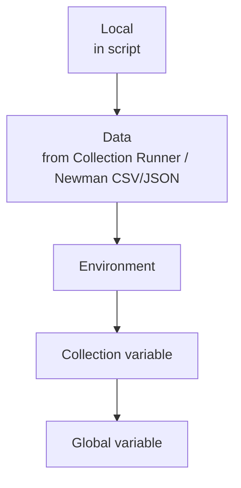

# Environment and Global Variables

> [!summary] TL;DR
> **Variables** let you reuse values across requests and switch environments (dev / staging / prod) with one click. **Environments** group related variables; **globals** are available everywhere.

## Variable Scopes

Postman resolves `{{var}}` using this precedence (highest first):



| Scope        | Lifetime               | Where set                              |
| ------------ | ---------------------- | -------------------------------------- |
| **Global**   | Persistent             | Manage Environments → Globals          |
| **Collection** | Persistent           | Collection → Variables tab             |
| **Environment** | Persistent          | Manage Environments → create env       |
| **Data**     | Per-run (Runner/Newman)| CSV/JSON file in Collection Runner     |
| **Local**    | Per-request run        | `pm.variables.set('x', val)` in script |

## Creating an Environment

1. Left sidebar → **Environments** → **+ Create Environment**.
2. Name it (e.g. `Dev`).
3. Add variables:

| Variable  | Initial Value    | Current Value    |
| --------- | ---------------- | ---------------- |
| baseUrl   | https://dev.api  | https://dev.api  |
| username  | ada              | ada              |
| token     |                  | (will be set)    |

4. Save.

Repeat for `Staging` and `Prod` with same variable names, different values.

## Using Variables in Requests

- URL: `{{baseUrl}}/users`
- Headers: `Authorization: Bearer {{token}}`
- Body: `{ "name": "{{username}}" }`
- Query params: key `limit`, value `{{pageSize}}`

## Switching Environments

Top-right dropdown in the header bar. Pick `Dev`, `Staging`, or `Prod`. All `{{baseUrl}}` references update.

> [!tip] Initial vs Current
> **Initial Value** is shared (synced to team). **Current Value** is local — useful for keeping secrets out of synced storage. Use "Persist All Variables" to push current → initial.

## Setting Variables from Scripts

```javascript
// In a Test script:
const json = pm.response.json();
pm.environment.set('userId', json.id);
pm.environment.set('token', json.token);
```

```javascript
// Local (only this run):
pm.variables.set('tmpCounter', 1);

// Collection-level:
pm.collectionVariables.set('totalCreated', 0);

// Global:
pm.globals.set('defaultTimeout', 5000);
```

## Globals — When to Use

Use **globals** sparingly for truly app-wide values:

- `defaultTimeout`
- `currentVersion`
- `featureFlagsUrl`

Avoid using globals for environment-specific values — that's what environments are for.

## Secrets in Variables

- For sensitive values, leave **Initial Value** blank and only set **Current Value** locally.
- Use Postman's **secret variable** type (mask in UI, excluded from sync).
- For teams: integrate with vault (HashiCorp Vault, AWS Secrets Manager) via Postman integrations.

## Dynamic Variables

Postman ships with built-in dynamic variables you can use directly:

| Variable              | Example output                |
| --------------------- | ----------------------------- |
| `{{$guid}}`           | `550e8400-e29b-...`           |
| `{{$timestamp}}`      | `1719488400`                  |
| `{{$randomInt}}`      | `42`                          |
| `{{$randomEmail}}`    | `ada.doe@example.com`         |
| `{{$randomFirstName}}`| `Ada`                         |
| `{{$randomLastName}}` | `Lovelace`                    |
| `{{$randomUuid}}`     | random UUID                   |

Example: create a unique user per run.

```json
{
  "email": "user_{{$timestamp}}@example.com",
  "name": "{{$randomFirstName}}"
}
```

## Exporting / Importing Environments

- Click environment → **Export** → JSON file.
- Import via Environments → **Import**.

> [!warning] Don't commit secret env files to public repos
> Use `.gitignore` or a separate `*.local.json` file.

## Related Notes
- [[Collections and Folders]] · [[Pre-request Scripts]] · [[Authentication]] · [[Collection Runner]]
