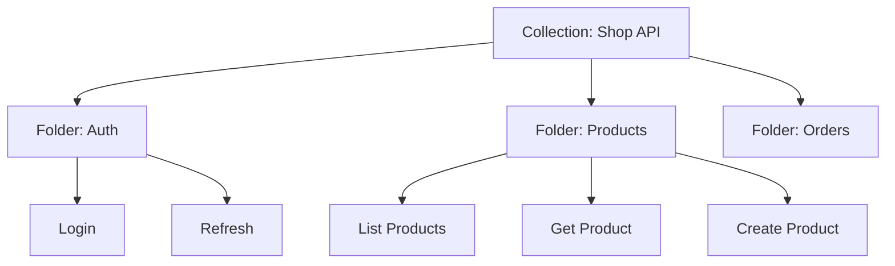
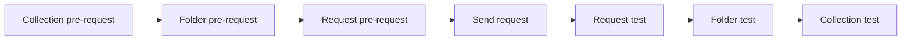

# Collections and Folders

> [!summary] TL;DR
> A **collection** is a saved group of requests. **Folders** organize them hierarchically. Collections also carry shared auth, variables, scripts, and tests.

## Why Collections?

- **Organization** — group by API, resource, or workflow.
- **Reuse** — share auth, headers, and scripts across requests.
- **Documentation** — auto-generate API docs.
- **Testing** — run all requests via [[Collection Runner]] or [[NewmanCLI]].
- **Sharing** — export/import or publish to the Postman API Network.

## Structure



## Creating a Collection

1. Sidebar → **Collections** → **+**.
2. Name it (e.g. "Shop API").
3. Add description (Markdown supported).
4. Set **Authorization** (inherited by all requests).
5. Set **Variables** (collection-scoped).

## Adding Requests

- Drag from open tabs → **Save** → pick collection/folder.
- Or **Add a request** from a collection's three-dot menu.

## Folders

- Used for grouping.
- Can carry their own auth, scripts, and tests (inherited by child requests).
- Nest as deep as you like (recommended max 2–3 levels).

## Collection-Level Settings

| Setting          | Purpose                                                   |
| ---------------- | --------------------------------------------------------- |
| Authorization    | Default auth inherited by all requests.                   |
| Pre-request Script | Runs before every request in the collection.             |
| Tests            | Runs after every request.                                 |
| Variables        | Collection-scoped variables.                              |
| Description      | Markdown shown in docs.                                    |

## Order of Script Execution



## Exporting / Importing

- Export → Collection v2.1 JSON (`collection.json`).
- Import via **Import** button → file or link.

Useful for:
- Backup.
- Sharing outside a workspace.
- Version-controlling with Git.

## Best Practices

-  Use folders by resource (`/users`, `/orders`).
-  Set common auth at the collection level.
-  Add descriptions to every request — they become docs.
-  Use `{{baseUrl}}` everywhere.
-  Add tests to every request (status code + content-type).
-  Name requests clearly: "Create user — 201", "Create user — validation error".

## Example Collection Layout

```text
Shop API
├── Auth
│   ├── POST Login
│   ├── POST Refresh
│   └── POST Logout
├── Products
│   ├── GET List
│   ├── GET by ID
│   ├── POST Create
│   ├── PATCH Update
│   └── DELETE Remove
├── Orders
│   ├── GET List
│   ├── POST Create
│   └── POST Cancel
└── Webhooks (mock)
    └── POST Order Created
```

## Related Notes
- [[Environment and Global Variables]] · [[Pre-request Scripts]] · [[Test Scripts]] · [[Collection Runner]]
