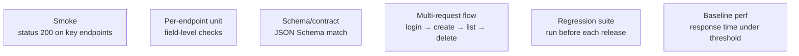
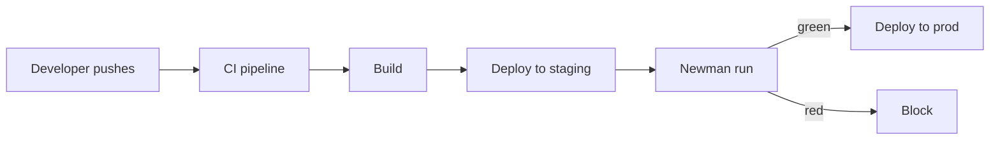

# Assertions and Automated API Testing

> [!summary] TL;DR
> Postman + `pm.test()` + [[Collection Runner]] (or [[NewmanCLI]]) turns your collection into a full API test suite — unit, integration, contract, smoke, regression.

## Layers of API Tests



## Test Pyramid for APIs

| Level        | Count   | What to check                          |
| ------------ | ------- | -------------------------------------- |
| Smoke        | Few     | Critical endpoints return 2xx.         |
| Functional   | Many    | Per-endpoint status, body, schema.     |
| Integration  | Several | Multi-step flows.                      |
| Contract     | Many    | Schema validations.                    |
| Negative     | Many    | Bad inputs return proper 4xx.          |
| Performance  | Few     | Response time / size thresholds.       |

## Schema Validation (Contract Tests)

```javascript
const schema = {
  type: 'object',
  required: ['id', 'email', 'createdAt'],
  properties: {
    id: { type: 'integer', minimum: 1 },
    email: { type: 'string', format: 'email' },
    role: { type: 'string', enum: ['admin', 'user', 'guest'] },
    createdAt: { type: 'string', format: 'date-time' }
  },
  additionalProperties: false
};

pm.test('Matches user schema', () => {
  pm.response.to.have.jsonSchema(schema);
});
```

> [!tip] Generate schema from response
> Right-click a response in the body → **Generate JSON schema**. Postman will draft one for you.

## Negative Tests

```javascript
// POST with invalid email
pm.test('Returns 422 for bad email', () => {
  pm.response.to.have.status(422);
  const j = pm.response.json();
  pm.expect(j.errors[0].field).to.eql('email');
});
```

## Chaining Requests into a Flow

Run a flow: **Login → Create user → Get user → Delete user → Verify deleted**.

1. **Login** Tests:
   ```javascript
   const j = pm.response.json();
   pm.environment.set('token', j.token);
   pm.environment.set('userId', j.userId);
   ```
2. **Create user** Tests:
   ```javascript
   pm.test('Created', () => pm.response.to.have.status(201));
   const j = pm.response.json();
   pm.environment.set('createdUserId', j.id);
   ```
3. **Get user** Tests:
   ```javascript
   pm.test('User exists', () => {
     pm.response.to.have.status(200);
     const j = pm.response.json();
     pm.expect(j.id).to.eql(parseInt(pm.environment.get('createdUserId')));
   });
   ```
4. **Delete user** Tests:
   ```javascript
   pm.test('Deleted', () => pm.response.to.have.status(204));
   ```
5. **Get user again** Tests:
   ```javascript
   pm.test('Not found after delete', () => pm.response.to.have.status(404));
   ```

## Data-Driven Tests

Use [[Collection Runner]] with a CSV/JSON data file:

```csv
email,password,expectedStatus
ada@x.com,Pass123!,200
bad-email,Pass123!,422
ada@x.com,wrong,401
```

In Tests, read data:

```javascript
pm.test(`Expected status ${pm.iterationData.get('expectedStatus')}`, () => {
  pm.response.to.have.status(parseInt(pm.iterationData.get('expectedStatus')));
});
```

## Test Reports

- **Collection Runner** shows pass/fail per request per iteration.
- **Newman** can export JUnit XML, HTML, JSON reporters — perfect for CI.
- **Postman API** lets you fetch run results programmatically.

## CI/CD Integration



See [[NewmanCLI]] for setup.

## Best Practices

-  One assertion per `pm.test` whenever possible — clearer failures.
-  Use descriptive names: "Returns 201 with Location header".
-  Group by folder per feature.
-  Keep flows independent — clean up after yourself (DELETE what you POST).
-  Use environment variables to pass IDs between requests.
-  Skip cleanup-only requests when running smoke tests (use folder-level test skipping).

## Related Notes
- [[Test Scripts]] · [[Collection Runner]] · [[NewmanCLI]] · [[Real-World Workflows]]
