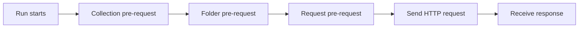

# Pre-request Scripts

> [!summary] TL;DR
> **Pre-request scripts** run in JavaScript *before* the request is sent. Use them to compute values, sign requests, fetch tokens, or generate dynamic data.

## Where They Run



You can attach a pre-request script at the request, folder, or collection level. They run in order from outermost to innermost.

## What You Can Do

- Set variables (`pm.environment.set`, `pm.variables.set`, `pm.collectionVariables.set`, `pm.globals.set`).
- Get variables (`pm.variables.get`, `pm.environment.get`, etc.).
- Read request data (`pm.request.url`, `pm.request.headers`, `pm.request.body`).
- Send other HTTP requests (`pm.sendRequest`).
- Compute signatures (HMAC, JWT, AWS SigV4 — usually via libraries).
- Generate timestamps, UUIDs, hashes.

## The `pm` Object (Cheat Sheet)

| API                          | Purpose                                  |
| ---------------------------- | ---------------------------------------- |
| `pm.variables.get('k')`      | Read any-scope variable.                 |
| `pm.variables.set('k', v)`   | Set a local (run-only) variable.         |
| `pm.environment.get/set`     | Read/write environment variable.         |
| `pm.collectionVariables.get/set` | Read/write collection variable.      |
| `pm.globals.get/set`         | Read/write global variable.              |
| `pm.request.url`             | The request URL object.                  |
| `pm.request.headers`         | Request headers (HeaderList).            |
| `pm.sendRequest(opts, cb)`   | Send another HTTP request.               |
| `console.log(...)`           | Log to the Postman console.              |

## Example 1: Add a Timestamp Header

```javascript
const ts = Date.now().toString();
pm.request.headers.add({ key: 'X-Timestamp', value: ts });
```

## Example 2: HMAC-SHA256 Signature

```javascript
// Requires CryptoJS (built into Postman sandbox)
const CryptoJS = require('crypto-js');

const secret = pm.environment.get('api_secret');
const method = pm.request.method;
const url = pm.request.url.getPathWithQuery();
const ts = Date.now().toString();
const body = pm.request.body.raw || '';

const stringToSign = [method, url, ts, body].join('\n');
const sig = CryptoJS.HmacSHA256(stringToSign, secret).toString(CryptoJS.enc.Hex);

pm.request.headers.add({ key: 'X-Signature', value: sig });
pm.request.headers.add({ key: 'X-Timestamp', value: ts });
```

## Example 3: Generate a JWT (signed)

```javascript
const CryptoJS = require('crypto-js');

function base64url(s) {
  return s.toString(CryptoJS.enc.Base64)
           .replace(/=+$/,'')
           .replace(/\+/g,'-')
           .replace(/\//g,'_');
}

const header = base64url(CryptoJS.enc.Utf8.parse(JSON.stringify({ alg: 'HS256', typ: 'JWT' })));
const payload = base64url(CryptoJS.enc.Utf8.parse(JSON.stringify({
  sub: 'ada',
  iat: Math.floor(Date.now()/1000),
  exp: Math.floor(Date.now()/1000) + 3600
})));
const secret = pm.environment.get('jwt_secret');
const sig = base64url(CryptoJS.HmacSHA256(header + '.' + payload, secret));

pm.environment.set('jwt', header + '.' + payload + '.' + sig);
```

## Example 4: Fetch an Access Token if Missing

```javascript
if (!pm.environment.get('access_token')) {
  pm.sendRequest({
    url: pm.environment.get('baseUrl') + '/oauth/token',
    method: 'POST',
    header: { 'Content-Type': 'application/x-www-form-urlencoded' },
    body: {
      mode: 'urlencoded',
      urlencoded: [
        { key: 'grant_type', value: 'client_credentials' },
        { key: 'client_id', value: pm.environment.get('client_id') },
        { key: 'client_secret', value: pm.environment.get('client_secret') }
      ]
    }
  }, (err, res) => {
    if (err) throw err;
    const j = res.json();
    pm.environment.set('access_token', j.access_token);
    pm.environment.set('expires_at', Date.now() + j.expires_in * 1000);
  });
}
```

## Console & Debugging

- **View → Show Postman Console** (or `Ctrl/Cmd + Alt + C`).
- Use `console.log`, `console.warn`, `console.error`.
- Inspect variable values across runs.

## Common Mistakes

-  Forgetting that `pm.sendRequest` is **async** — use the callback.
-  Reading `pm.request.body` without checking if it exists (GET has none).
-  Setting variables that should be local with `pm.environment.set` (use `pm.variables.set`).
-  Using synchronous-only libraries — the sandbox supports many but not all Node modules.

## Related Notes
- [[Test Scripts]] · [[Environment and Global Variables]] · [[Authentication]] · [[Assertions and Automated API Testing]]
