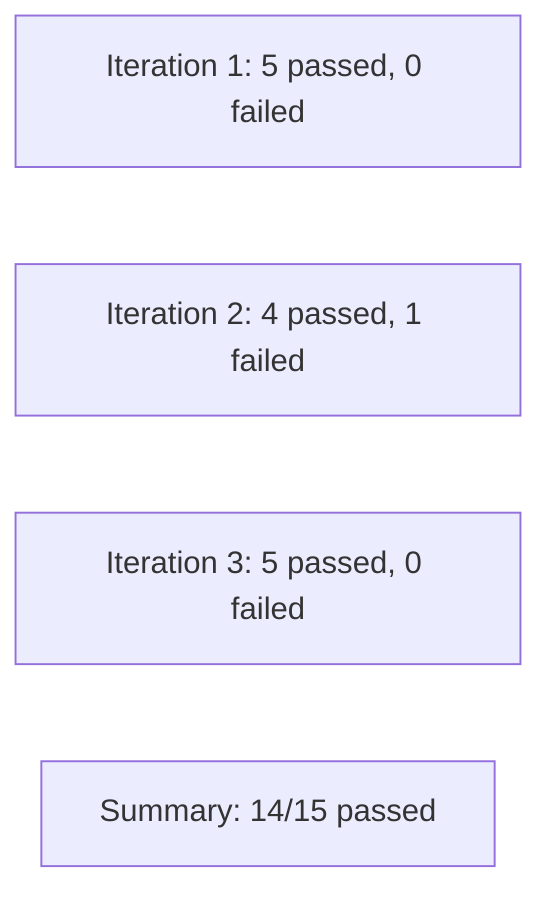

# Collection Runner

> [!summary] TL;DR
> The **Collection Runner** lets you run an entire collection (or folder) of requests sequentially, with optional data files and multiple iterations.

## Opening the Runner

Two ways:

1. Sidebar → hover a collection → ** Run** icon.
2. **Runner** button at top of the workspace.

## Runner UI

```mermaid
flowchart TB
    Sel[Select collection / folder]
    Env[Choose environment]
    Iter[Iterations: N]
    Data[Data file: CSV/JSON]
    Delay[Delay between requests (ms)]
    Log[Log responses: Yes/No]
    Save[Save responses: Yes/No]
    Cert[Certs / proxies]
    Run[Run button]
```

## Key Options

| Option            | What it does                                            |
| ----------------- | ------------------------------------------------------- |
| **Iterations**    | How many times to run the whole collection.             |
| **Delay**         | Pause (ms) between requests.                            |
| **Data**          | CSV/JSON file → drives data-driven tests.               |
| **Persist response** | Save response bodies (uses disk space).              |
| **Save responses** | Save responses to history.                              |
| **Environment**   | Pick env to use.                                        |
| **Stop on error** | Stop the run on first failure.                          |

## Data-Driven Example

CSV:

```csv
email,expectedStatus
ada@x.com,200
not-an-email,422
missing@x.com,404
```

Each row = one iteration. In your Tests:

```javascript
const expected = parseInt(pm.iterationData.get('expectedStatus'));
pm.test(`Status is ${expected}`, () => {
  pm.response.to.have.status(expected);
});
```

3 iterations run, each picks a different `email` and `expectedStatus`.

## Run Results



For each request, the Runner shows:
- Status (pass/fail).
- Response status code & time.
- Test results (named).
- Failed assertions highlighted.

## Use Cases

- **Smoke test** before deploy.
- **Regression test** after a code change.
- **Data-driven testing** with CSV inputs.
- **Workflow testing** (login → create → list → delete).

## When to Use Newman Instead

| Need                                  | Use                |
| ------------------------------------- | ------------------ |
| Interactive runs with UI              | Collection Runner  |
| Scheduled in CI/CD                    | [[NewmanCLI]]      |
| Docker / Kubernetes jobs              | [[NewmanCLI]]      |
| Custom reporters (JUnit/HTML/Slack)   | [[NewmanCLI]]      |
| Headless / programmatic               | [[NewmanCLI]]      |

## Tips

-  Use **Stop on error** during debugging.
-  Disable requests you don't want to run via the checkbox list.
-  Save run results as JSON for sharing.
-  Use **Persist response** only when needed — it's slow.

## Related Notes
- [[NewmanCLI]] · [[Assertions and Automated API Testing]] · [[Test Scripts]] · [[Environment and Global Variables]]
