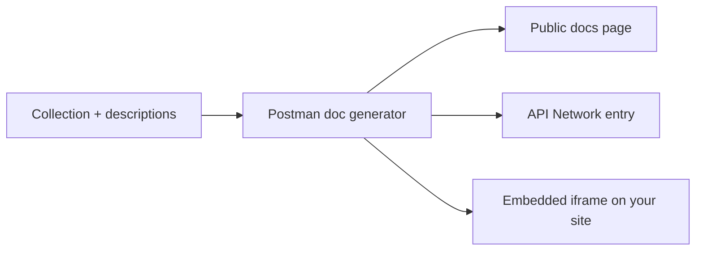

# API Documentation

> [!summary] TL;DR
> Postman auto-generates beautiful API docs from your collections — every request, example, and description becomes a doc page.

## Publishing Docs

Two ways:

### A) Public Documentation (no login required to view)

1. Open the collection → three-dot menu → **View documentation**.
2. **Publish** → **Public Documentation**.
3. Pick a subdomain (`myapi.postman.co`).
4. Share the URL.

### B) Private Documentation (login required)

Same flow but **Private** — viewers must be in your team.

## What Docs Include

| Section         | Source                                   |
| --------------- | ---------------------------------------- |
| Overview        | Collection description (Markdown).       |
| Endpoints       | Each saved request.                      |
| Method + Path   | From the request.                        |
| Description     | Request description (Markdown).          |
| Parameters      | Query/path params + headers.             |
| Body            | Request body (raw / form-data / etc.).   |
| Examples        | Saved examples (request + response).     |
| Code snippets   | cURL, Python, JS, Go, Java, etc.         |



## Writing Good Descriptions

Each saved request has a description field (Markdown). Tips:

- One sentence on **what** the endpoint does.
- Required params + valid values.
- Side effects (creates, mutates, deletes).
- Common error codes with meanings.
- An example response.

```markdown
## Create User

Creates a new user account.

- **Email** must be unique; returns 409 otherwise.
- **Role** must be one of: `admin`, `user`, `guest`.
- Sends a welcome email on success.

### Errors

| Code | Meaning                       |
| ---- | ----------------------------- |
| 400  | Invalid request body.         |
| 409  | Email already exists.         |
| 422  | Validation error (see body).  |
```

## Examples — Save Them

A request without an example looks barren in docs. Always save at least:

- A **success** example (200/201).
- One **error** example (e.g. 401 or 422).

To save an example:
1. Send the request.
2. On the response, click **Save Response → Save as Example**.
3. Name it ("Success 200", "Validation error 422").

## Adding Code Snippets

Postman auto-generates code for cURL, HTTPie, many languages. In docs, these appear under the request.

## Customizing the Public Page

- **Branding**: cover image, logo, color (paid plans).
- **Categories**: group endpoints.
- **Custom domain**: paid plans.

## Related Notes
- [[Collections and Folders]] · [[Mock Servers]] · [[Workspaces and Collaboration]]
