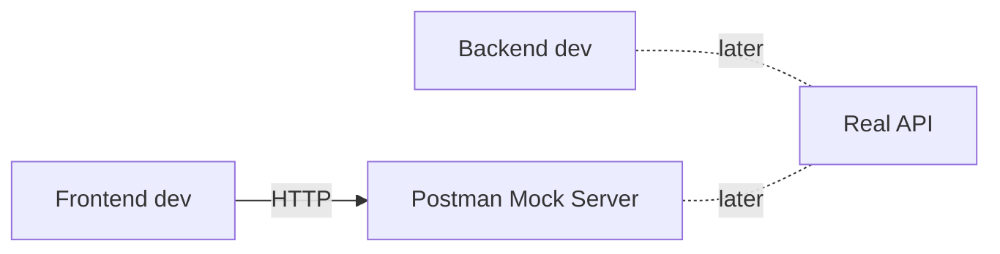
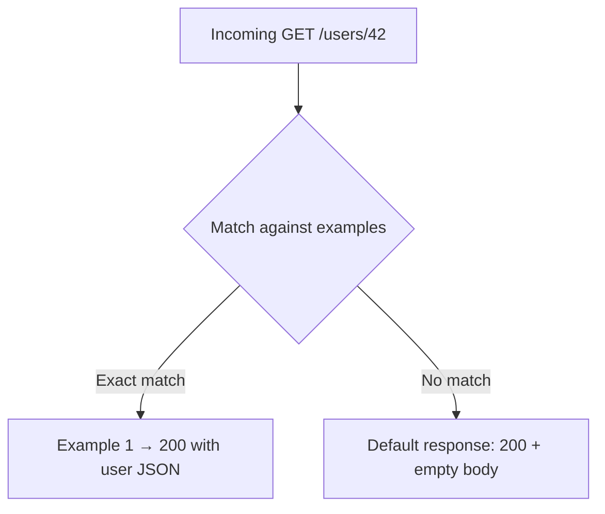

# Mock Servers

> [!summary] TL;DR
> A **mock server** returns canned responses for your API endpoints — letting frontend development proceed before the real backend exists.

## Why Mock?

- Frontend & backend work in parallel.
- Test client edge cases (errors, timeouts) without server changes.
- Demo an API before it's built.
- Run smoke tests when the real API is down.



## Creating a Mock Server

Two ways:

### A) From an Existing Request

1. Open a saved request.
2. Click the **Examples** dropdown (top right) → **Add Example**.
3. Set the request (method, path, params) and the response (status, headers, body).
4. Save.

### B) From Scratch

1. Sidebar → **Mock Servers** → **Create Mock Server**.
2. Pick a collection (or create one).
3. Define endpoints (path + method + example response).
4. Set environment for mock (Postman creates `{{mockUrl}}`).
5. Save.

## How Mocking Matches Requests

The mock server matches the incoming request against saved **examples** by:

1. Method (GET/POST/…)
2. Path (with `{{pathVar}}` support)
3. Query string
4. Request body
5. Headers (when configured)

If multiple examples match, the first match wins.



## Using the Mock URL

After creating a mock, you get a URL like:
```text
https://<random-id>.mock.pstmn.io
```

Set `baseUrl` in a "Mock" environment to this URL and your requests automatically use it.

## Dynamic Responses

Mock servers don't run scripts — but you can:

- Define **multiple examples** per request and select via header `Prefer: code=404`.
- Use **mock response headers** like `X-Postman-Mock-Response-Name` to identify which example was returned.

## Mock Server Limits

- No scripting/logic — purely static responses.
- Free tier: limited mock calls/month.
- Examples are part of the collection — they ship with it.

## Best Practices

-  Define both **success** and **error** examples.
-  Use realistic status codes (201, 204, 422).
-  Version your examples when the API changes.
-  Put mocks in their own workspace/folder for clarity.

## Related Notes
- [[API Documentation]] · [[Workspaces and Collaboration]] · [[Real-World Workflows]]
