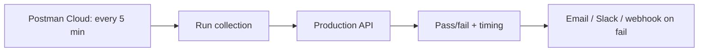

# Monitors

> [!summary] TL;DR
> A **monitor** runs a collection on a schedule from Postman's cloud — useful for uptime checks, synthetic monitoring, and scheduled regression tests.

## Why Use Monitors?

- **Uptime monitoring** — ping critical endpoints every 5 min.
- **Synthetic monitoring** — run a login + checkout flow every hour.
- **Scheduled regression** — run the API test suite nightly.
- **Performance baseline** — track response time trends.

## Creating a Monitor

1. Sidebar → **Monitors** → **+**.
2. Pick a collection (or specific folder).
3. Choose **environment** (e.g. Prod).
4. Set **schedule** (cron or simple interval).
5. Pick **region** (e.g. US East, EU West).
6. Configure **notifications** (email, Slack, integration webhooks).
7. Save.

## Schedule Examples

| Frequency     | Field value            |
| ------------- | ---------------------- |
| Every 5 min   | `*/5 * * * *`           |
| Every hour    | `0 * * * *`             |
| Daily at 3am  | `0 3 * * *`             |
| Weekdays 9am  | `0 9 * * 1-5`           |

## Monitor Results

For each run you see:
- Pass/fail per request.
- Test pass/fail counts.
- Response time per request.
- Console logs (use `console.log` in pre-request/tests).
- Average response time trend across runs.

## Notifications

| Channel          | Trigger                       |
| ---------------- | ----------------------------- |
| Email            | On any failure.               |
| Slack            | On any failure (or always).   |
| PagerDuty        | On call escalation.           |
| Custom webhook   | Send payload to your service. |

## Best Practices

-  Keep monitor collections small (5–20 requests) — they run from the cloud and have time limits.
-  Use a dedicated **monitor environment** with prod credentials.
-  Add a "ping" request first — if it fails, the rest likely will too.
-  Set alerts on response-time regression, not just failures.
-  Use `pm.test` for `responseTime < 1000` so you catch slow APIs.

## Limits (Free Tier)

- 1,000 monitor runs / month.
- 1 region only.

## Related Notes
- [[Collection Runner]] · [[NewmanCLI]] · [[Assertions and Automated API Testing]]
