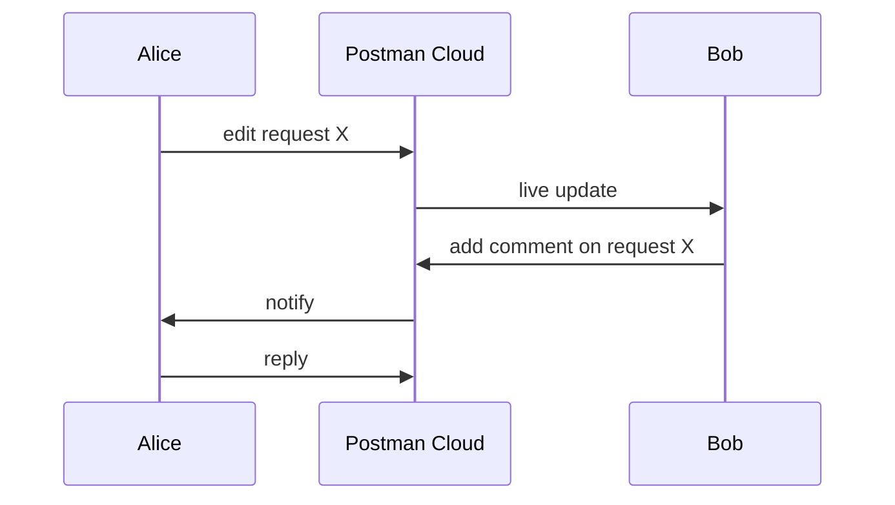

# Workspaces and Collaboration

> [!summary] TL;DR
> A **workspace** is a shared context for collections, environments, mocks, and monitors. Postman workspaces make team collaboration seamless.

## Workspace Types

| Type       | Visibility                            | Use case                                |
| ---------- | ------------------------------------- | --------------------------------------- |
| **Personal** | Only you.                           | Personal projects.                      |
| **Team**   | Anyone in your team.                  | Most team work.                         |
| **Private** (paid) | Specific members only.         | Sensitive projects.                     |
| **Public** | Anyone on the internet (read-only).   | Open APIs, samples.                     |

## Creating a Workspace

1. Top-left dropdown → **Create Workspace**.
2. Pick type → name → description.
3. (Team/Private) invite members by email.

## What's Shared in a Workspace

- Collections (including requests, tests, examples).
- Environments (be careful with secrets — see [[Environment and Global Variables]]).
- Mock servers.
- Monitors.
- API definitions (OpenAPI / GraphQL schemas).
- History is **per-user**, not shared.

## Roles (Team Workspaces, Paid)

| Role       | Permissions                                  |
| ---------- | -------------------------------------------- |
| Viewer     | Read-only.                                   |
| Editor     | Read + edit collections/requests.            |
| Admin      | Edit + manage members + delete workspace.    |

## Real-Time Collaboration

- Multiple people can edit the **same collection** simultaneously.
- You see avatars of who's editing.
- Comments: right-click any request → **Comment**.

## Forking & Merging (Paid)

- **Fork** a collection to your workspace to make changes.
- **Pull request** to merge back to the parent.
- Reviewers approve → changes merge.

Similar to Git, but for collections.

## API Network

Publish APIs your team builds to your **Private API Network** (internal) or **Public API Network** (anyone). Great for discoverability.

## Best Practices

-  One workspace per team or per product line.
-  Keep secrets in env vars marked "secret" — or use a vault integration.
-  Use forking for risky changes.
-  Use comments to discuss changes before applying.
-  Archive old workspaces instead of deleting (preserve history).

## Common Mistakes

-  Putting prod credentials in a Personal workspace (others can't access — breaks monitors).
-  Hard-coding values that should be env variables (collisions across team).
-  Mixing test and prod environments in the same workspace.

## Related Notes
- [[Environment and Global Variables]] · [[Collections and Folders]] · [[Importing and Exporting]]
