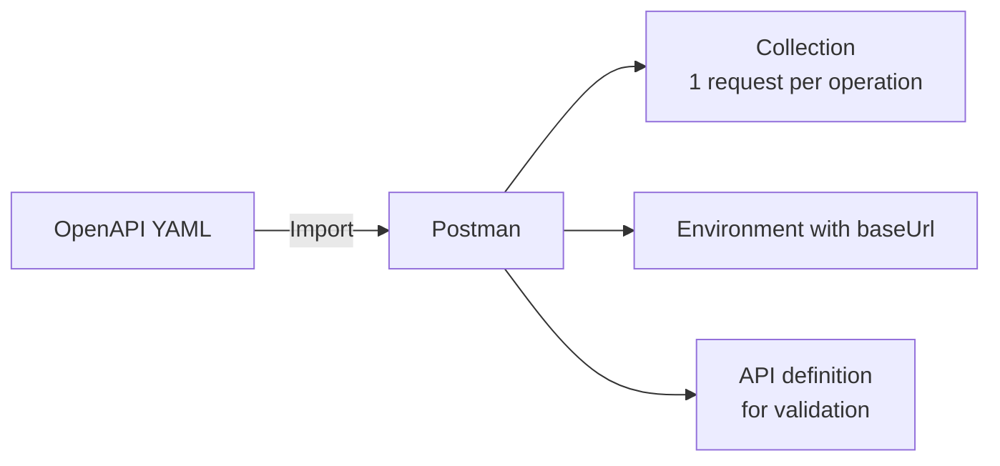
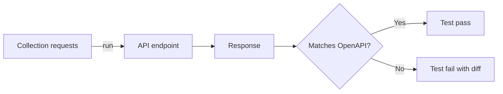

# OpenAPI and Swagger

> [!summary] TL;DR
> **OpenAPI** (formerly Swagger) is the standard spec format for describing REST APIs. Postman can import, generate, and validate against OpenAPI documents.

## What's the Difference?

| Term       | Meaning                                                  |
| ---------- | -------------------------------------------------------- |
| **OpenAPI** | The current spec name (v3.x). Owned by the Linux Foundation. |
| **Swagger** | The original tooling + spec (pre-OpenAPI 3.0).           |
| **Swagger Editor** | Online editor for OpenAPI specs.                |
| **Swagger UI** | Renders an OpenAPI doc as interactive HTML.        |

## OpenAPI Document Structure (v3.x)

```yaml
openapi: 3.0.3
info:
  title: Shop API
  version: 1.0.0
servers:
  - url: https://api.example.com/v1
paths:
  /users/{id}:
    get:
      summary: Get a user
      parameters:
        - name: id
          in: path
          required: true
          schema: { type: integer }
      responses:
        '200':
          description: OK
          content:
            application/json:
              schema:
                $ref: '#/components/schemas/User'
        '404':
          description: Not found
components:
  schemas:
    User:
      type: object
      required: [id, email]
      properties:
        id: { type: integer }
        email: { type: string, format: email }
        name: { type: string }
```

## Importing OpenAPI into Postman

1. **Import** → file / URL / raw text.
2. Postman auto-detects format.
3. Pick collection name + whether to create a Postman API definition.
4. Result: a **collection** with one request per operation.



## Generating OpenAPI from a Postman Collection

1. Open collection → three-dot menu → **Export**.
2. Pick **OpenAPI 3.0** format.
3. Save `.yaml` / `.json`.

## API Validation

Postman can validate your collection against an OpenAPI schema:

1. Create an **API** entity in Postman sidebar.
2. Upload the OpenAPI spec.
3. Link the API to your collection.
4. Run **Contract Tests** — Postman checks every response against the schema.



## Schema-Driven Mocks

Once you have an API definition, you can:

1. **Generate mock server** from the API.
2. Postman returns example responses for each operation.

Great for parallel frontend development.

## Schema-Driven Tests

Use **Postman API Builder** to generate test scaffolding:

- One request per operation.
- Schema checks pre-filled.
- Just fill in env vars and run.

## Best Practices

-  Keep your OpenAPI spec in Git alongside the API code.
-  Use spec-first development: design → review → implement.
-  Generate Postman collections from spec in CI — always in sync.
-  Validate responses against schema in your test suite.

## Related Notes
- [[REST GraphQL WebSocket gRPC]] · [[API Documentation]] · [[Mock Servers]] · [[Assertions and Automated API Testing]]
