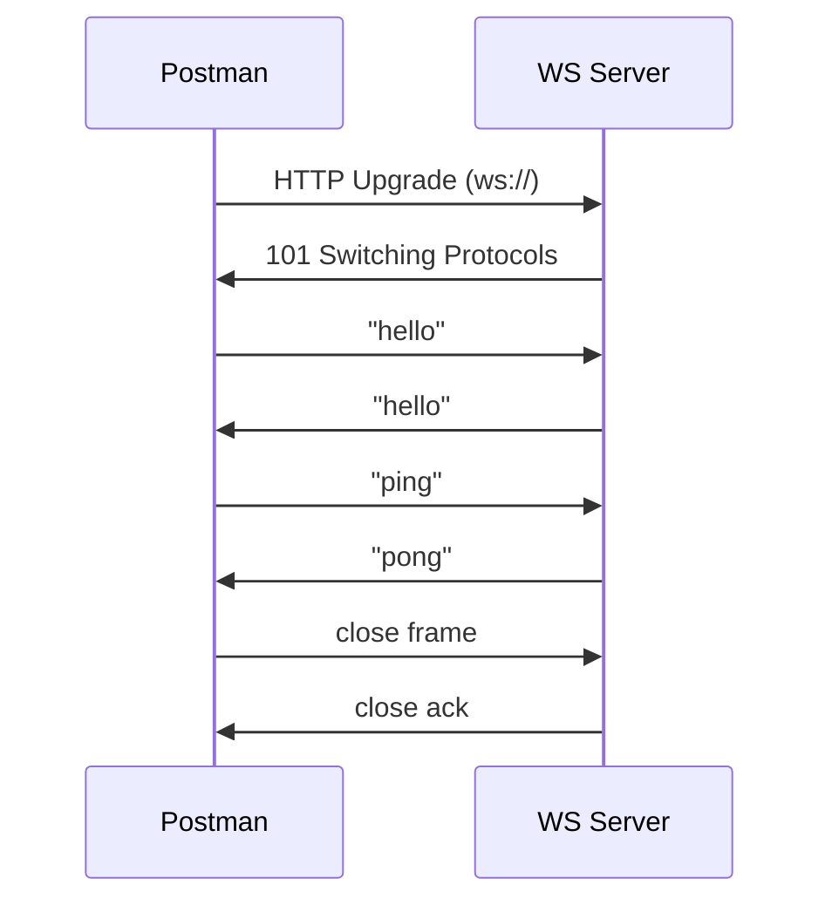
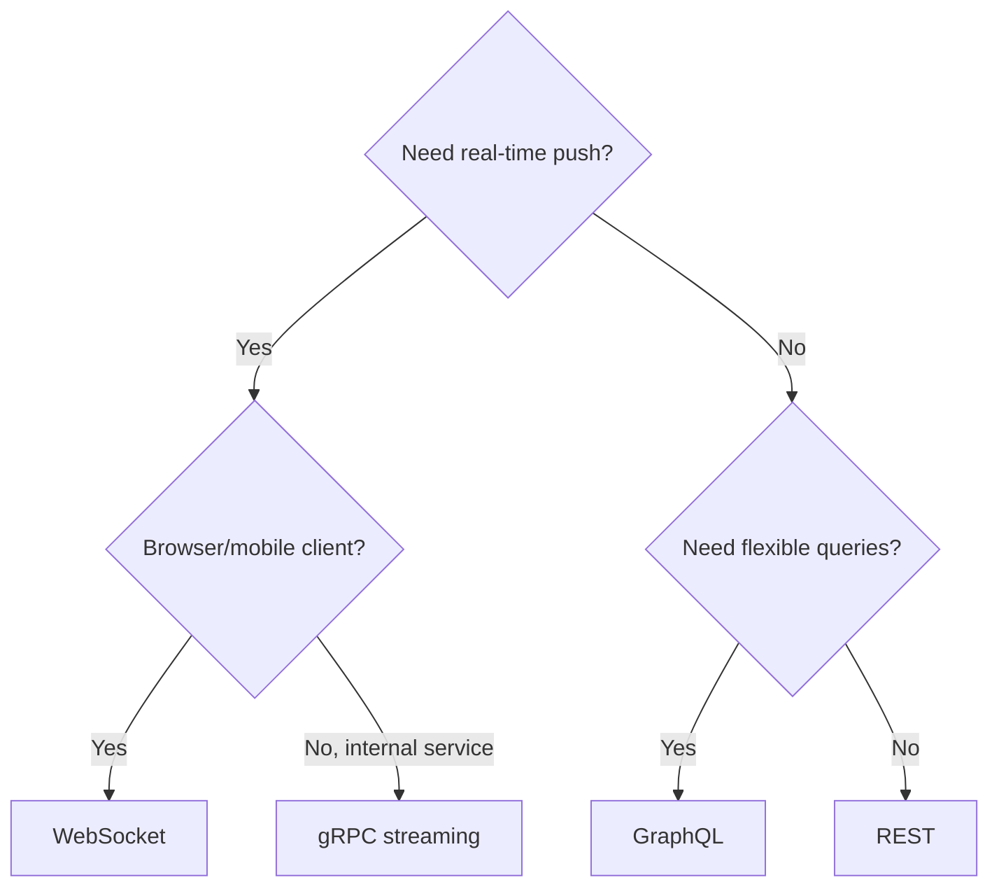

# REST, GraphQL, WebSocket, and gRPC

> [!summary] TL;DR
> Postman supports four major API styles out of the box: **REST**, **GraphQL**, **WebSocket**, and **gRPC**. Same UI patterns, different request formats.

## Comparison

| Style       | Transport       | Encoding     | Schema     | Typical use                          |
| ----------- | --------------- | ------------ | ---------- | ------------------------------------ |
| **REST**    | HTTP/1.1        | JSON / XML   | OpenAPI    | Most web APIs.                       |
| **GraphQL** | HTTP/1.1 (POST) | JSON         | GraphQL SDL | Flexible queries for clients.       |
| **WebSocket** | HTTP upgrade → TCP | Text/binary | Optional  | Real-time bidirectional comms.       |
| **gRPC**    | HTTP/2          | Protobuf     | `.proto`   | High-perf internal service-to-service.|

## 1. REST

The default in Postman. Every previous example in this vault was REST.

- Method-based (GET/POST/PUT/PATCH/DELETE).
- Multiple endpoints, one per resource.
- HTTP status codes carry meaning.

See [[HTTP Methods]] and [[APIs and HTTP]].

## 2. GraphQL

GraphQL exposes a single endpoint (usually `/graphql`). Clients send a **query** (read), **mutation** (write), or **subscription** (real-time via WebSocket).

### Sending a GraphQL Query in Postman

1. Method = **POST**.
2. URL = `https://api.example.com/graphql`.
3. **Body** → select **GraphQL**.
4. Write query:

```graphql
query {
  user(id: 42) {
    id
    name
    email
    posts(first: 5) {
      title
    }
  }
}
```

5. **Query Variables** section (just below):

```json
{ "id": 42 }
```

Use variables in the query with `$`:

```graphql
query GetUser($id: ID!) {
  user(id: $id) { id name }
}
```

```mermaid
flowchart LR
    Client[Postman] -->|POST /graphql<br/>{query, variables}| GQL[GraphQL Server]
    GQL -->|JSON response<br/>exact fields requested| Client
```

### Introspection

Postman can introspect a GraphQL API to give you autocomplete:

- URL → **...** → **Fetch schema**.
- Now type your query and get field suggestions.

## 3. WebSocket

WebSocket is a persistent, full-duplex connection. Postman supports it natively.

### Opening a WebSocket

1. New tab → click **WebSocket** (dropdown next to **+**).
2. URL: `wss://echo.websocket.org`.
3. Click **Connect**.
4. Type a message → **Send**.
5. Echo response appears in the messages panel.



### Tips

- Send text or binary (file).
- Save messages as part of the saved request.
- Use scripts: `ws.send(JSON.stringify({...}))` and listen via `ws.on('message', ...)` (collection runner supported).

## 4. gRPC

gRPC uses HTTP/2 + Protocol Buffers. Postman supports unary, server-streaming, client-streaming, and bidirectional streaming.

### Setup

1. New tab → **gRPC Request** (next to **+**).
2. URL: `grpc.example.com:443`.
3. **Select service method**:
   - Import `.proto` file from disk or URL.
   - Or use **Server Reflection** (auto-discover).
4. Pick a method (e.g. `/user.UserService/GetUser`).
5. Compose message (JSON; Postman converts to Protobuf):
   ```json
   { "id": 42 }
   ```
6. **Invoke**.

### Streaming

- **Server streaming**: invoke once, receive multiple responses.
- **Client streaming**: send multiple messages, then **Send / Finish**.
- **Bidirectional**: interleave sends and receives.

## When to Use Which



## Related Notes
- [[APIs and HTTP]] · [[HTTP Methods]] · [[OpenAPI and Swagger]]
