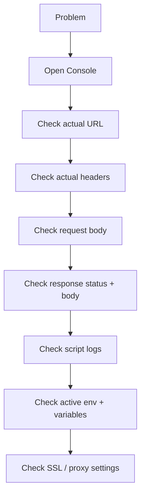

# Best Practices, Common Mistakes, and Troubleshooting

> [!summary] TL;DR
> A consolidated checklist to keep your Postman workflow clean, fast, and reliable.

##  Best Practices

### Organize

- Use **folders** by resource (`/users`, `/orders`).
- Name requests with status intent: "Create user — 201", "Create user — 422 (bad email)".
- One workspace per team or product line.
- Use **collections** for one API or one workflow.

### Variables

- Always use `{{baseUrl}}` — never hard-code hosts.
- Use **environments** for dev / staging / prod.
- Use **secret variable** type for tokens / passwords.
- Use **collection variables** for non-env-specific values.
- Don't rely on globals except for truly app-wide defaults.

### Auth

- Set common auth at the **collection level**.
- Use `withCredentials`-style patterns to inject tokens.
- Rotate tokens — never hard-code.
- Use OAuth 2.0 token management for refreshable tokens.

### Scripts

- Pre-request scripts: minimal, fast, well-commented.
- Test scripts: one assertion per `pm.test`.
- Use `console.log` for debugging — remove before sharing.
- Save data to variables to chain requests.

### Collections

- Add descriptions to every request (they become docs).
- Save success + error **examples** for each request.
- Export to Git for version control.
- Pin collection version when used by CI.

### CI/CD

- Pin Newman version in CI.
- Generate JUnit XML for visualization.
- Block deploys on test failure.
- Use CI secrets for env vars (don't bake into collection).

### Performance

- Add response-time assertions for critical endpoints.
- Track trends via [[Monitors]].
- Use real load-testing tools (k6, JMeter) for high RPS.

### Security

- Never commit secrets in exported env files.
- Use vault integrations for shared secrets.
- Review workspace members regularly.
- Disable SSL verification **only** for local dev.

##  Common Mistakes

| Mistake                                  | Fix                                        |
| ---------------------------------------- | ------------------------------------------ |
| Hard-coded URLs and tokens               | Use variables.                             |
| Tests without names (`pm.test('', ...)`) | Always name tests.                         |
| One giant test with many assertions      | Split into many `pm.test` calls.           |
| Using `pm.environment.set` for one-off   | Use `pm.variables.set`.                    |
| Mixing dev and prod in same env          | Separate environments.                     |
| Saving secrets as Initial Value          | Use Current Value or secret type.          |
| Following redirects blindly              | Disable in dev to see redirect chain.      |
| Skipping examples                        | Always save success + error examples.      |
| Not cleaning up created resources        | Add a cleanup folder; run after tests.     |
| Ignoring the Console                     | It's the first place to debug.             |

##  Troubleshooting Cheat Sheet

### Request fails with `ECONNREFUSED`

- Server not running on the host/port.
- Check URL, ports, VPN.

### `unable to verify the first certificate`

- Self-signed or corp MITM cert.
- **Settings → SSL certificate verification → OFF** (dev only).
- Or add the corp root CA in **Settings → Certificates**.

### `401 Unauthorized`

- Token missing or expired.
- Check `{{token}}` is set and non-empty.
- Re-run the login request.

### `403 Forbidden`

- Token valid but lacks scope/role.
- Check the user's permissions.

### Variables not substituted

- Wrong env selected (top-right dropdown).
- Variable name typo.
- Variable not defined in the selected env (only in another env or globals).

### Test passes in Runner, fails in Newman

- Different env file.
- Newman version mismatch — pin Newman to match your Postman version.
- Missing globals file (`-g`).

### `pm.response.json()` throws

- Body isn't JSON. Check status (maybe HTML error page).
- Use `try/catch`:

```javascript
let body;
try { body = pm.response.json(); } catch (e) { body = {}; }
```

### Slower in Newman than in Postman app

- Network latency from CI server.
- Runner runs sequentially — use parallel processes for load.

## Diagnostic Checklist



## Useful Links

- Postman docs: <https://learning.postman.com/>
- Postman API Network: <https://www.postman.com/api-network/>
- Newman docs: <https://github.com/postmanlabs/newman>
- Postman Community Forum: <https://community.postman.com/>

## Related Notes
- [[Shared/readme]] · [[Real-World Workflows]] · [[Debugging Requests]] · [[Assertions and Automated API Testing]]
