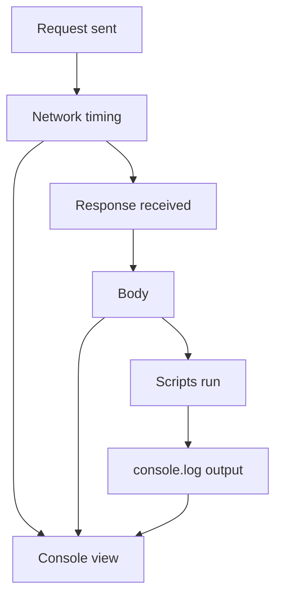

# Debugging Requests

> [!summary] TL;DR
> Postman gives you several tools to figure out *why* a request isn't behaving — Console, request inspection, response inspection, and proxies.

## 1. The Postman Console

**View → Show Postman Console** (or `Ctrl/Cmd + Alt + C`).

Shows, for every request:

- Actual URL after variable substitution.
- All headers (request and response) — including auto-added ones.
- Request body.
- Response body.
- Network timing (DNS, connect, TLS, wait, download).
- `console.log` output from scripts.



> [!tip] Always check the Console
> When a request behaves strangely, the Console is the first place to look — it shows what Postman *actually* sent, not what you think you sent.

## 2. Inspect the Actual Request

Sometimes Postman adds headers you don't expect (`User-Agent`, `Accept`, `Accept-Encoding`, `Host`). In the Headers tab, click **hidden** to see them.

## 3. Inspect the Response

- **Pretty** — formatted JSON/XML/HTML.
- **Raw** — exact bytes.
- **Preview** — render HTML.
- **Visualize** — write custom HTML/JS to render the response (useful for charts).
- **Headers** — response headers.
- **Cookies** — set/changed cookies.

## 4. Network Timing

In the response pane, click **Time** to see:

- DNS lookup.
- TCP connection.
- TLS handshake.
- Waiting (TTFB).
- Content download.

Slow APIs often show long "Waiting" — server-side issue.

## 5. Disable SSL Verification (Dev Only!)

For self-signed certs:

- **Settings → General → SSL certificate verification → OFF**.
- Or per-request: **Settings tab → SSL certificate verification → OFF**.

> [!warning] Always re-enable in production
> Disabling SSL lets attackers MITM your traffic. Use only for local dev.

## 6. Disable Follow Redirects

By default Postman follows 3xx redirects. To see the redirect chain:

- **Settings tab → Follow redirects → OFF**.

## 7. Use a Proxy / Charles / Fiddler

To capture and inspect every byte:

1. Start a proxy tool (Charles, Fiddler, mitmproxy).
2. Postman → **Settings → Proxy → Use system proxy** OR custom proxy `127.0.0.1:8888`.
3. Watch traffic in the proxy tool.

## 8. Console Logs in Scripts

```javascript
// Pre-request
console.log('URL:', pm.request.url.toString());
console.log('Headers:', pm.request.headers.toJSON());

// Test
console.log('Status:', pm.response.code);
console.log('Body:', pm.response.text());
console.log('Time (ms):', pm.response.responseTime);
```

## 9. `pm.sendRequest` for Side Investigation

Hit another endpoint mid-flow to debug:

```javascript
pm.sendRequest('https://httpbin.org/headers', (err, res) => {
  if (err) { console.error(err); return; }
  console.log(res.json());
});
```

## Common Issues & Fixes

| Symptom                       | Likely cause                              | Fix                                |
| ----------------------------- | ----------------------------------------- | ---------------------------------- |
| `Error: unable to verify`     | Self-signed cert.                         | Disable SSL verify for that host.  |
| `ECONNREFUSED`                | Server not running / wrong port.          | Check URL & service.               |
| `401 Unauthorized`            | Token missing or expired.                 | Re-login, check `{{token}}`.       |
| `403 Forbidden`               | Token lacks scope.                        | Check scopes / roles.              |
| Works in browser, not Postman | CORS or missing cookie.                   | Add cookie header; CORS doesn't apply to Postman. |
| Variables not substituted     | Wrong scope or env not selected.          | Check top-right env dropdown.      |
| Tests pass locally, fail in Newman | Different env vars.                 | Use same env file.                 |

## Related Notes
- [[Pre-request Scripts]] · [[Test Scripts]] · [[Environment and Global Variables]] · [[Best Practices and Troubleshooting]]
