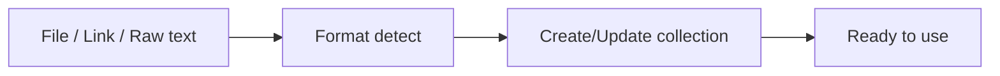

# Importing and Exporting

> [!summary] TL;DR
> Postman can import and export collections, environments, globals, OpenAPI specs, curl commands, and more.

## Exporting

### Collections

1. Right-click collection → **Export**.
2. Pick format:
   - **Collection v2.1** (recommended).
   - **Collection v1** (legacy).
   - **OpenAPI 3.0** (converts to OpenAPI).
3. Save `.json` / `.yaml`.

### Environments / Globals

1. **Environments** sidebar → click the env → **Export**.
2. Save `.json`.

> [!warning] Don't commit env files with secrets
> Either scrub them or use a separate `.local.json` ignored by Git.

### Single Request as cURL

1. Open the request.
2. Click `</>` icon (right side of URL bar).
3. Pick **cURL** → copy.

### Collection as Code

Postman can generate code in many languages: JavaScript (fetch, axios, XHR), Python (requests), Go (net/http), Java (OkHttp), PHP (cURL), Ruby (net/http), Shell (cURL, wget)…

## Importing

### Supported Formats

- Postman Collection v1 / v2 / v2.1.
- Postman Environment / Globals.
- OpenAPI 3.x / Swagger 2 / Swagger 1.
- cURL command (`curl 'https://...'`).
- WSDL (for SOAP).
- GraphQL schema.
- HAR (HTTP Archive).
- Postman API Network link.

### How To Import

1. **Import** button (sidebar).
2. Pick source:
   - **File** — upload from disk.
   - **Link** — paste URL (e.g. OpenAPI spec).
   - **Raw text** — paste content.
3. Postman auto-detects format.
4. Review settings (collection name, env) → **Import**.

## Common Workflows

### Git-Backed Team Setup

1. Export collection + env templates to repo.
2. Each teammate imports them.
3. Teammates fill in their own `.env.local.json` with secrets.

### CI Pipeline

1. Repo contains `collection.json` + `env.ci.json`.
2. CI installs Newman → `newman run collection.json -e env.ci.json`.

### Sharing a Single Request

1. Save the request → **Share** → **Get public link**.
2. Anyone with the link can open in their Postman.

## Related Notes
- [[Collections and Folders]] · [[Environment and Global Variables]] · [[NewmanCLI]] · [[Workspaces and Collaboration]]
