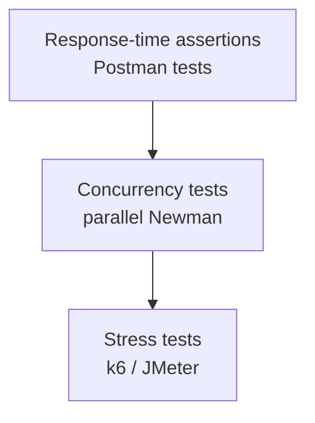

# Performance Testing Basics

> [!summary] TL;DR
> Postman isn't a full load-testing tool, but it can do **baseline performance testing**: response-time assertions, repeated runs, and concurrency via `pm.sendRequest`.

## What Postman Can Do

| Capability                       | Tool                              |
| -------------------------------- | --------------------------------- |
| Response time assertions         | `pm.test` + `pm.response.responseTime` |
| Repeated runs (sequential)       | Collection Runner with N iterations |
| Concurrent runs                  | Limited — `pm.sendRequest` in pre-request, but not true load |
| Trend tracking                   | [[Monitors]]                      |
| Full load tests (1k+ RPS)        | Use k6, JMeter, Gatling, Locust   |

## Response-Time Assertions

In Tests:

```javascript
pm.test('Response under 500ms', () => {
  pm.expect(pm.response.responseTime).to.below(500);
});

pm.test('Response size under 10KB', () => {
  pm.expect(pm.response.headers.get('Content-Length')).to.exist;
});
```

## Sequential Load (Collection Runner)

1. Build a 5-request collection.
2. Runner → 100 iterations → 0 ms delay.
3. Watch avg/p95 response time across iterations.

> [!note] This is sequential, not parallel
> True load testing needs parallelism. Use Newman with concurrent processes or a real load-testing tool.

## Parallel Runs with Newman

Run Newman multiple times in parallel:

```bash
for i in {1..10}; do
  newman run collection.json -e env.prod.json -n 50 &
done
wait
```

This gives 10 parallel processes × 50 iterations = 500 sequential requests in ~10 parallel streams.

## Better: Use k6 or JMeter

For real load tests:

```bash
# k6 example
k6 run --vus 100 --duration 30s script.js
```

```javascript
// k6 script
import http from 'k6/http';
export default function () {
  http.get('https://api.example.com/users');
}
```

You can even **convert a Postman collection to k6** with `postman-to-k6`:

```bash
npx postman-to-k6 collection.json -o k6-script.js
k6 run k6-script.js
```

## Performance Test Pyramid



## What to Monitor

- **Response time** (avg, p95, p99).
- **Throughput** (RPS).
- **Error rate** (% non-2xx).
- **Server metrics** (CPU, memory, DB connections) — via APM.
- **Network** (DNS, TLS, download time — from Postman Console).

## Common Performance Pitfalls

-  N+1 queries on the server (watch with load tests).
-  Missing DB indexes.
-  Synchronous external API calls.
-  Large payloads (slow JSON parsing).
-  Cold starts (serverless).

## Best Practices

-  Run baseline tests on every release.
-  Track trends with [[Monitors]].
-  Fail builds on regression (Newman in CI).
-  Combine with APM (Datadog, New Relic) for server-side visibility.

## Related Notes
- [[Test Scripts]] · [[Monitors]] · [[NewmanCLI]] · [[Real-World Workflows]]
