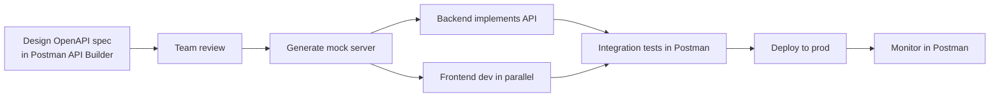
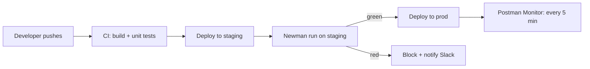
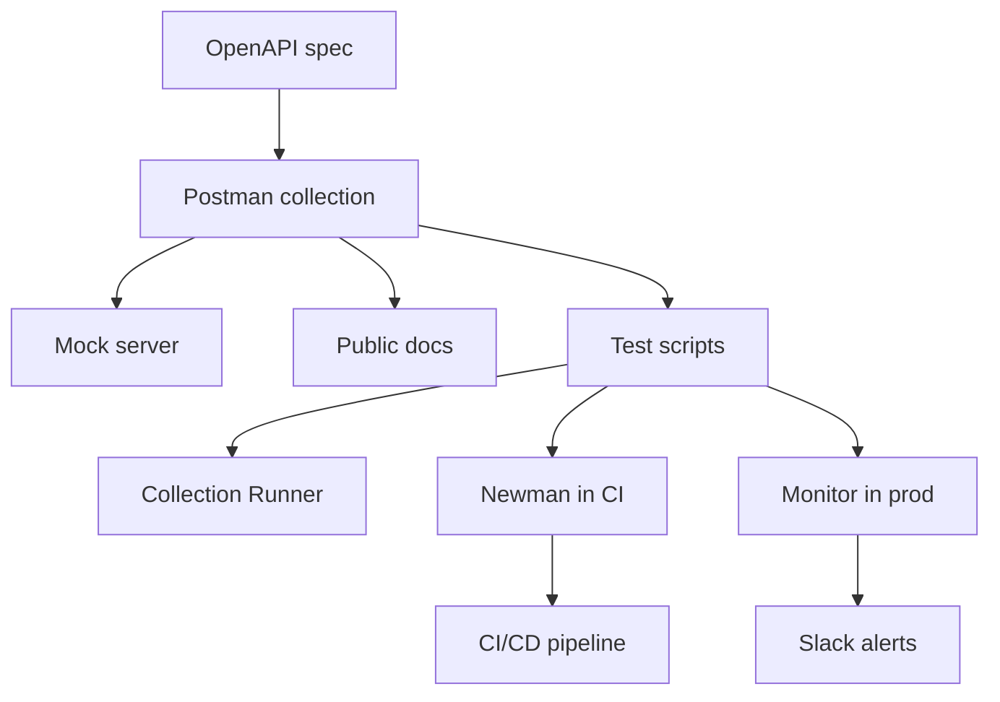

# Real-World Workflows and Projects

> [!summary] TL;DR
> How Postman fits into realistic engineering workflows: API design → develop → test → document → monitor → CI/CD.

## Workflow 1: Spec-First API Design



Steps:
1. **API Builder** → New API → upload/create OpenAPI.
2. Generate **mock server** + collection from the spec.
3. Share mock URL with frontend.
4. Backend codes against the spec; runs the collection as tests.
5. On deploy, enable a **monitor** for uptime + smoke tests.

## Workflow 2: CI/CD Pipeline with Newman



See [[NewmanCLI]] for the YAML.

## Workflow 3: Onboarding a Third-Party API

1. Import their OpenAPI spec → Postman collection.
2. Create env (`baseUrl`, `apiKey`).
3. Configure auth (API key header / OAuth).
4. Send a "ping" request (e.g. `GET /health`).
5. Walk through key endpoints, saving examples.
6. Add tests (`status 200`, schema validation).
7. Add to a **monitor** for uptime checks.

## Workflow 4: Building a Test Suite for Your Own API

```text
tests/
├── collection.json
├── env.dev.json
├── env.staging.json
├── env.prod.json
└── data/
    ├── users.csv
    └── orders.csv
```

Collection structure:

```text
My API
├── Smoke
│   ├── GET /health
│   └── GET /version
├── Auth
│   ├── POST /login
│   ├── POST /refresh
│   └── POST /logout
├── Users
│   ├── GET /users (list)
│   ├── POST /users (create) — data-driven
│   ├── GET /users/:id
│   ├── PATCH /users/:id
│   └── DELETE /users/:id
├── Negative
│   ├── POST /users — invalid email
│   ├── POST /users — missing fields
│   └── GET /users/:id — not found
└── Cleanup
    └── DELETE test users
```

Run locally: Collection Runner.
Run in CI: Newman + JUnit reporter.

## Workflow 5: Demoing an API to a Customer

1. Build a clean collection with good descriptions.
2. Save success + error examples.
3. **Publish** docs → public link.
4. (Optional) Share a runnable collection via **Run in Postman** button.

## Workflow 6: Chaos / Error-Path Testing

Use [[Mock Servers]] to simulate:
- 500 errors.
- 5-second delays.
- Malformed JSON.

Frontend teams test their error handling without touching prod.

## Workflow 7: Production Incident Response

1. Pull the failing request from history.
2. Open Postman Console to inspect actual bytes.
3. Reproduce with different params / tokens.
4. Save an **example** of the bad response.
5. Add a regression test that fails on the bad response shape.

## Putting It All Together



## Related Notes
- [[OpenAPI and Swagger]] · [[Mock Servers]] · [[NewmanCLI]] · [[Monitors]] · [[Best Practices and Troubleshooting]]
