#  Postman Vault

> [!info] Welcome
> This vault takes you from beginner to advanced in Postman. Open any note below or follow links inside notes to explore.

##  Map of Content

### 1. Introduction
- [[Introduction to Postman]]
- [[Installing and Setting Up]]
- [[APIs and HTTP]]

### 2. Requests
- [[Creating and Sending Requests]]
- [[HTTP Methods]]
- [[Headers Params and Body]]

### 3. Authentication
- [[Authentication]]

### 4. Variables
- [[Environment and Global Variables]]

### 5. Collections
- [[Collections and Folders]]

### 6. Scripts
- [[Pre-request Scripts]]
- [[Test Scripts]]
- [[Assertions and Automated API Testing]]

### 7. Automation
- [[Collection Runner]]
- [[Newman CLI]]

### 8. Advanced Features
- [[Mock Servers]]
- [[API Documentation]]
- [[Monitors]]
- [[Workspaces and Collaboration]]

### 9. Protocols & Specs
- [[REST GraphQL WebSocket gRPC]]
- [[OpenAPI and Swagger]]

### 10. Practice
- [[Importing and Exporting]]
- [[Debugging Requests]]
- [[Performance Testing]]
- [[Real-World Workflows]]
- [[Best Practices and Troubleshooting]]

---

##  Suggested Learning Path

```mermaid
flowchart LR
    A[Intro to Postman] --> B[Install]
    B --> C[APIs & HTTP]
    C --> D[Send Requests]
    D --> E[HTTP Methods]
    E --> F[Headers/Params/Body]
    F --> G[Auth]
    G --> H[Variables]
    H --> I[Collections]
    I --> J[Pre-request Scripts]
    J --> K[Test Scripts]
    K --> L[Assertions]
    L --> M[Collection Runner]
    M --> N[Newman]
    N --> O[Mock Servers]
    O --> P[Monitors]
    P --> Q[Workspaces]
    Q --> R[GraphQL/gRPC]
    R --> S[OpenAPI]
    S --> T[Real-World Workflows]
```

##  Quick Start

1. Download Postman from <https://www.postman.com/downloads/>.
2. Read [[Introduction to Postman]] and [[APIs and HTTP]].
3. Send your first request with [[Creating and Sending Requests]].
4. Build a collection ([[Collections and Folders]]) and add tests ([[Test Scripts]]).
5. Automate via [[Collection Runner]] or [[NewmanCLI]].
